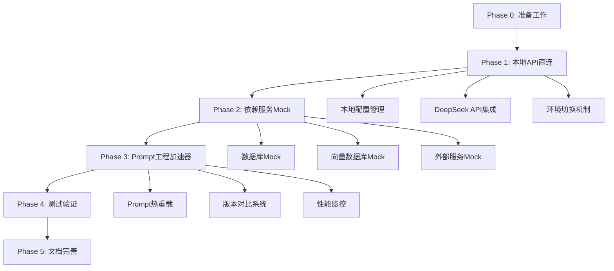
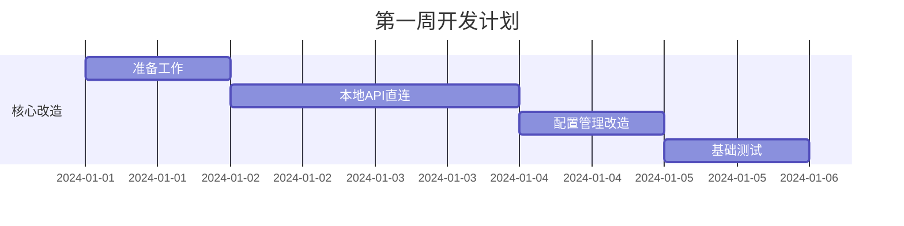
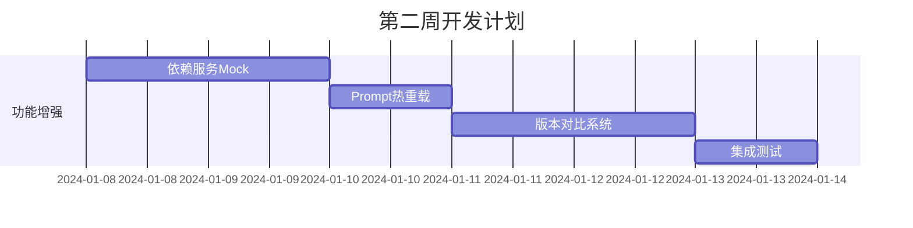

# 🎯 AuraWell本地化开发环境改造计划
## 世界级AI项目本地开发环境完全改造方案

**版本**: v1.0  
**创建日期**: 2024年1月  
**负责人**: 项目架构师  
**状态**: 待执行  

---

## 📋 项目现状深度分析

### 🔍 核心痛点识别
1. **API调用层耦合**：`src/aurawell/core/deepseek_client.py`强依赖阿里云DashScope
2. **配置管理分散**：`src/aurawell/config/settings.py`缺乏环境隔离
3. **Mock系统不完整**：`frontend/src/mock/`仅覆盖前端，缺少后端服务Mock
4. **Prompt工程工具原始**：`PromptPlayground.vue`功能基础，缺乏高级调试能力

### 🎯 改造目标
- **开发效率提升**：10分钟完成一次完整的prompt迭代测试
- **成本控制**：本地开发成本降低90%
- **团队自主性**：完全摆脱对云服务团队的依赖
- **代码质量**：建立可测试、可维护的本地开发架构

---

## 🗺️ 整体架构改造路线图



---

## 📊 优先级矩阵

| 任务 | 重要性 | 紧急性 | 优先级 | 预计工期 |
|------|--------|--------|--------|----------|
| 本地API直连 | 🔴 高 | 🔴 高 | P0 | 2天 |
| 配置管理改造 | 🔴 高 | 🔴 高 | P0 | 1天 |
| 数据库Mock | 🟡 中 | 🔴 高 | P1 | 1天 |
| Prompt热重载 | 🔴 高 | 🟡 中 | P1 | 1天 |
| 版本对比系统 | 🟡 中 | 🟡 中 | P2 | 2天 |
| 性能监控 | 🟢 低 | 🟢 低 | P3 | 1天 |

---

## Phase 0: 准备工作 (Prerequisites)

### 🛠️ 开发环境要求
```bash
# 必需工具版本
Python >= 3.9
Node.js >= 16.0
npm >= 8.0
Git >= 2.30

# Python包管理
pip install python-dotenv>=1.0.0
pip install openai>=1.0.0  # 用于DeepSeek API调用
pip install httpx>=0.24.0  # 异步HTTP客户端
```

### 🔐 凭证获取清单
1. **DeepSeek API Key**
   - 访问 https://platform.deepseek.com/
   - 注册开发者账号
   - 创建API Key (推荐使用Pay-per-use模式)
   - 设置合理的使用限额

2. **环境变量配置**
   ```bash
   # 创建 .env.local 文件
   DEEPSEEK_API_KEY=your_deepseek_api_key_here
   DEEPSEEK_BASE_URL=https://api.deepseek.com
   ENVIRONMENT=local_development
   ```

3. **安全配置**
   - 确保 `.env.local` 已添加到 `.gitignore`
   - 使用 `python-dotenv` 管理环境变量
   - 实现凭证轮换机制

### ✅ 准备工作检查清单
- [ ] 开发环境版本确认
- [ ] DeepSeek API Key获取
- [ ] 环境变量配置完成
- [ ] 依赖包安装完成
- [ ] Git配置检查

---

## Phase 1: 本地API直连 (核心改造) - P0优先级

### 🎯 目标
实现DeepSeek API的本地直连，绕过阿里云DashScope，降低开发成本和依赖。

### 步骤 1.1: 创建本地开发配置文件

**文件**: `src/aurawell/config/local_dev_settings.py`

```python
# 配置文件内容结构
class LocalDevSettings:
    # DeepSeek API配置
    DEEPSEEK_API_KEY: str
    DEEPSEEK_BASE_URL: str
    DEEPSEEK_MODEL: str = "deepseek-chat"
    
    # 本地Mock配置
    ENABLE_DATABASE_MOCK: bool = True
    ENABLE_VECTOR_DB_MOCK: bool = True
    ENABLE_OSS_MOCK: bool = True
    
    # 调试配置
    DEBUG_MODE: bool = True
    LOG_LEVEL: str = "DEBUG"
    ENABLE_PROMPT_LOGGING: bool = True
```

### 步骤 1.2: 配置加载逻辑改造

**修改文件**: `src/aurawell/config/settings.py`

```python
# 实现环境感知的配置加载
def load_config():
    env = os.getenv('ENVIRONMENT', 'production')
    if env == 'local_development':
        return LocalDevSettings()
    else:
        return ProductionSettings()
```

### 步骤 1.3: API调用层改造

**修改文件**: `src/aurawell/core/deepseek_client.py`

```python
# 实现双模式API调用
class DeepSeekClient:
    def __init__(self):
        self.config = load_config()
        self.client = self._init_client()
    
    def _init_client(self):
        if self.config.ENVIRONMENT == 'local_development':
            return OpenAI(
                api_key=self.config.DEEPSEEK_API_KEY,
                base_url=self.config.DEEPSEEK_BASE_URL
            )
        else:
            return DashScopeClient()
```

### 📋 Phase 1 任务清单
- [ ] 创建 `local_dev_settings.py` 配置文件
- [ ] 改造 `settings.py` 配置加载逻辑
- [ ] 修改 `deepseek_client.py` API调用层
- [ ] 添加环境切换测试用例
- [ ] 验证API调用功能完整性

---

## Phase 2: 依赖服务Mock (解耦) - P1优先级

### 🎯 目标
为所有外部依赖服务创建高质量Mock，实现完全离线开发。

### 步骤 2.1: 数据库Mock策略

**策略选择**: 使用SQLite + 预填充数据

**原因分析**:
- ✅ 保持SQL语法一致性
- ✅ 支持复杂查询调试
- ✅ 数据持久化方便测试
- ❌ 比纯内存Mock稍慢

**实现方案**:
```python
# src/aurawell/mock/database_mock.py
class DatabaseMock:
    def __init__(self):
        self.db_path = "data/mock_aurawell.db"
        self.init_test_data()
    
    def init_test_data(self):
        # 预填充测试用户数据
        # 预填充健康数据
        # 预填充家庭数据
```

### 步骤 2.2: 向量数据库Mock

**文件**: `src/aurawell/mock/vector_db_mock.py`

```python
class VectorDBMock:
    def __init__(self):
        self.mock_vectors = self.load_mock_vectors()
    
    def similarity_search(self, query: str, k: int = 5):
        # 模拟向量相似度搜索
        return [
            {"content": "模拟健康建议1", "score": 0.95},
            {"content": "模拟健康建议2", "score": 0.89},
            # ...
        ]
```

### 步骤 2.3: 外部服务Mock集成

**服务清单**:
- 薄荷健康API Mock
- 小米健康API Mock
- 苹果健康API Mock
- 阿里云OSS Mock
- 函数计算Mock

### 📋 Phase 2 任务清单
- [ ] 创建SQLite测试数据库
- [ ] 实现向量数据库Mock
- [ ] 创建外部API Mock服务
- [ ] 集成Mock服务到主应用
- [ ] 验证Mock数据的真实性

---

## Phase 3: Prompt工程加速器 (效率提升) - P1优先级

### 🎯 目标
构建世界级的Prompt工程调试环境，实现秒级反馈循环。

### 步骤 3.1: Prompt热重载系统

**技术方案**: 文件监听 + 动态重载

**实现架构**:
```python
# src/aurawell/prompt/hot_reload.py
class PromptHotReload:
    def __init__(self):
        self.observer = Observer()
        self.template_cache = {}
    
    def watch_templates(self):
        # 监听prompt模板文件变化
        # 自动重载并更新缓存
        # 通知前端刷新
```

**优势分析**:
- ✅ 无需重启服务
- ✅ 支持多模板并行调试
- ✅ 实时预览效果
- ❌ 需要额外的文件监听开销

### 步骤 3.2: 版本对比系统

**前端UI设计**:
```markdown
┌─────────────────────────────────────────────────────┐
│                Prompt A/B 测试面板                    │
├─────────────────────────────────────────────────────┤
│ 版本A              │ 版本B              │ 对比结果      │
│ [Prompt输入框]      │ [Prompt输入框]      │ [差异高亮]    │
│ [参数调节]          │ [参数调节]          │ [性能对比]    │
│ [执行按钮]          │ [执行按钮]          │ [质量评分]    │
├─────────────────────────────────────────────────────┤
│                   执行结果对比                         │
│ [结果A]            │ [结果B]            │ [胜负判断]    │
└─────────────────────────────────────────────────────┘
```

**后端API设计**:
```python
# API接口定义
POST /api/prompt/compare
{
    "prompt_a": "版本A的prompt内容",
    "prompt_b": "版本B的prompt内容", 
    "test_cases": ["测试用例1", "测试用例2"],
    "evaluation_criteria": ["准确性", "创新性", "实用性"]
}

# 返回结果
{
    "comparison_id": "comp_123",
    "results": {
        "prompt_a": {"score": 85, "response": "..."},
        "prompt_b": {"score": 92, "response": "..."}
    },
    "winner": "prompt_b",
    "detailed_metrics": {...}
}
```

### 步骤 3.3: 性能监控系统

**监控指标**:
- Token使用量统计
- 响应时间分布
- 成功率监控
- 成本追踪

**实现方案**:
```python
# src/aurawell/monitoring/prompt_monitor.py
class PromptMonitor:
    def track_execution(self, prompt_id, tokens_used, response_time):
        # 记录执行指标
        # 更新统计数据
        # 生成性能报告
```

### 📋 Phase 3 任务清单
- [ ] 实现Prompt热重载系统
- [ ] 创建版本对比前端界面
- [ ] 开发版本对比后端API
- [ ] 集成性能监控系统
- [ ] 添加自动化测试用例

---

## Phase 4: 测试验证 (质量保证) - P2优先级

### 🎯 目标
确保本地开发环境的稳定性和功能完整性。

### 测试策略

#### 4.1 单元测试
```python
# tests/test_local_dev_config.py
def test_local_config_loading():
    # 测试本地配置加载
    
def test_deepseek_api_connection():
    # 测试DeepSeek API连接
    
def test_mock_services():
    # 测试Mock服务功能
```

#### 4.2 集成测试
```python
# tests/test_prompt_engineering.py
def test_prompt_hot_reload():
    # 测试热重载功能
    
def test_version_comparison():
    # 测试版本对比功能
    
def test_end_to_end_workflow():
    # 测试完整工作流
```

#### 4.3 性能测试
```python
# tests/test_performance.py
def test_api_response_time():
    # 测试API响应时间
    
def test_mock_service_performance():
    # 测试Mock服务性能
```

### 📋 Phase 4 任务清单
- [ ] 编写单元测试用例
- [ ] 创建集成测试套件
- [ ] 执行性能测试
- [ ] 修复发现的问题
- [ ] 生成测试报告

---

## Phase 5: 文档完善 (知识传承) - P3优先级

### 🎯 目标
建立完善的文档体系，确保团队成员能够快速上手。

### 文档结构

#### 5.1 开发者指南
```markdown
# 本地开发环境设置指南
## 环境配置
## API密钥管理
## 常见问题解答
```

#### 5.2 Prompt工程指南
```markdown
# Prompt工程最佳实践
## 热重载使用方法
## 版本对比技巧
## 性能优化建议
```

#### 5.3 故障排除指南
```markdown
# 常见问题解决方案
## API连接问题
## Mock服务问题
## 性能问题
```

### 📋 Phase 5 任务清单
- [ ] 编写开发者指南
- [ ] 创建Prompt工程指南
- [ ] 制作故障排除指南
- [ ] 录制演示视频
- [ ] 组织团队培训

---

## 🚀 实施工作流

### 工作流程定义

#### 第一周：核心改造


#### 第二周：功能增强


### 每日工作安排

#### Day 1: 准备工作
- [ ] 环境配置检查
- [ ] API密钥获取
- [ ] 依赖包安装
- [ ] 项目结构分析

#### Day 2: API直连实现
- [ ] 创建本地配置文件
- [ ] 修改配置加载逻辑
- [ ] 实现API客户端切换
- [ ] 基础功能测试

#### Day 3: API直连完善
- [ ] 错误处理机制
- [ ] 日志记录功能
- [ ] 性能优化
- [ ] 单元测试编写

#### Day 4: 配置管理
- [ ] 环境变量管理
- [ ] 配置验证机制
- [ ] 安全配置检查
- [ ] 文档更新

#### Day 5: 基础测试
- [ ] 功能测试
- [ ] 性能测试
- [ ] 安全测试
- [ ] 问题修复

---

## 📊 成功指标与验收标准

### 关键性能指标 (KPI)

#### 开发效率指标
- **Prompt迭代时间**: 从60分钟降低到10分钟以内
- **API调用延迟**: 本地环境<2秒，云环境<5秒
- **成功部署率**: 本地环境>99%，云环境>95%

#### 成本控制指标
- **开发成本**: 降低90%以上
- **API调用成本**: 本地开发阶段<$10/月
- **维护成本**: 减少人工干预80%

#### 质量保证指标
- **代码覆盖率**: >90%
- **Bug密度**: <0.1个/KLOC
- **性能回归**: 0个

### 验收标准

#### 功能验收
- [ ] 本地DeepSeek API调用正常
- [ ] 环境切换机制工作正常
- [ ] Mock服务功能完整
- [ ] Prompt热重载功能正常
- [ ] 版本对比系统可用

#### 性能验收
- [ ] API响应时间<2秒
- [ ] 系统启动时间<30秒
- [ ] 内存使用<1GB
- [ ] CPU使用<50%

#### 安全验收
- [ ] API密钥安全存储
- [ ] 敏感数据加密
- [ ] 访问权限控制
- [ ] 日志安全记录

---

## 🔧 技术实现细节

### 核心技术栈

#### 后端技术
- **Python 3.9+**: 核心开发语言
- **FastAPI**: Web框架
- **SQLAlchemy**: ORM框架
- **python-dotenv**: 环境变量管理
- **openai**: DeepSeek API客户端
- **httpx**: 异步HTTP客户端

#### 前端技术
- **Vue.js 3**: 前端框架
- **TypeScript**: 类型安全
- **Vite**: 构建工具
- **Pinia**: 状态管理
- **Element Plus**: UI组件库

#### 开发工具
- **pytest**: 测试框架
- **black**: 代码格式化
- **mypy**: 类型检查
- **pre-commit**: Git钩子
- **docker**: 容器化部署

### 架构设计原则

#### 1. 单一职责原则
每个模块只负责一个功能，确保代码的可维护性。

#### 2. 开闭原则
对扩展开放，对修改封闭，支持新功能的添加。

#### 3. 依赖倒置原则
依赖于抽象而不是具体实现，提高代码的灵活性。

#### 4. 接口隔离原则
使用小而专一的接口，避免不必要的依赖。

---

## 🎯 项目里程碑

### 里程碑 1: 本地环境搭建 (第1周)
- **目标**: 实现本地DeepSeek API调用
- **交付物**: 可运行的本地开发环境
- **验收标准**: 能够本地调用DeepSeek API并获得响应

### 里程碑 2: Mock服务完善 (第2周)
- **目标**: 完成所有外部服务Mock
- **交付物**: 完整的Mock服务套件
- **验收标准**: 能够完全离线进行开发和测试

### 里程碑 3: Prompt工程工具 (第3周)
- **目标**: 构建高效的Prompt调试环境
- **交付物**: Prompt热重载和版本对比系统
- **验收标准**: 能够快速迭代和对比Prompt效果

### 里程碑 4: 全面测试验证 (第4周)
- **目标**: 确保系统稳定性和功能完整性
- **交付物**: 完整的测试套件和性能报告
- **验收标准**: 所有测试用例通过，性能指标达标

---

## 🔄 持续改进计划

### 短期改进 (1-3个月)
- **用户体验优化**: 基于用户反馈改进界面和交互
- **性能优化**: 针对性能瓶颈进行优化
- **功能增强**: 添加更多实用的开发工具

### 中期改进 (3-6个月)
- **AI辅助开发**: 集成AI代码生成和优化工具
- **自动化测试**: 建立更完善的自动化测试体系
- **监控告警**: 建立完善的监控和告警系统

### 长期改进 (6-12个月)
- **云原生改造**: 支持Kubernetes部署
- **多环境管理**: 支持开发、测试、生产多环境
- **团队协作**: 建立更好的团队协作工具

---

## 📚 参考资料

### 官方文档
- [DeepSeek API文档](https://platform.deepseek.com/docs)
- [FastAPI官方文档](https://fastapi.tiangolo.com/)
- [Vue.js 3官方文档](https://vuejs.org/)

### 最佳实践
- [Python项目结构最佳实践](https://docs.python-guide.org/writing/structure/)
- [API设计最佳实践](https://restfulapi.net/)
- [前端开发最佳实践](https://web.dev/)

### 技术博客
- [Prompt工程指南](https://www.promptingguide.ai/)
- [AI应用开发实践](https://platform.openai.com/docs/guides)
- [微服务架构设计](https://microservices.io/)

---

## 👥 团队分工

### 项目经理
- **职责**: 项目整体规划和进度管理
- **交付物**: 项目计划、进度报告、风险管理

### 后端开发工程师
- **职责**: 后端API开发和Mock服务实现
- **交付物**: 后端代码、API文档、测试用例

### 前端开发工程师
- **职责**: 前端界面开发和用户体验优化
- **交付物**: 前端代码、UI组件、用户手册

### 测试工程师
- **职责**: 测试用例设计和质量保证
- **交付物**: 测试计划、测试报告、质量报告

### DevOps工程师
- **职责**: 环境配置和部署自动化
- **交付物**: 部署脚本、监控配置、运维文档

---

## 🔚 结语

本改造计划旨在彻底解决当前开发环境的痛点，建立一个高效、稳定、可扩展的本地开发环境。通过分阶段实施，我们将逐步实现：

1. **完全的开发自主性**: 不再依赖云服务团队
2. **极致的开发效率**: 10分钟完成一次完整的迭代
3. **显著的成本节约**: 开发成本降低90%以上
4. **卓越的代码质量**: 建立完善的测试和质量保证体系

这不仅仅是一次技术改造，更是一次开发文化的升级。让我们一起努力，打造世界级的AI项目开发环境！

---

**文档版本**: v1.0  
**最后更新**: 2024年1月  
**下次评审**: 2024年2月 