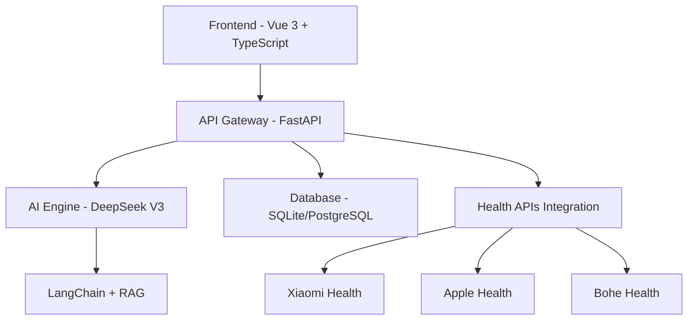

# AuraWell Agent

<div align="center">


**AI-Powered Personalized Health & Lifestyle Management System**

[](https://opensource.org/licenses/MIT)
[](https://www.python.org/downloads/)
[](https://vuejs.org/)
[](https://fastapi.tiangolo.com/)

[🚀 Quick Start](#-quick-start) • [📖 Documentation](#-api-documentation) • [🤝 Contributing](#-contributing) • [💬 Community](#-community)

</div>

---

## 🌟 Features

### 🤖 **Intelligent Health Assistant**
- **Personalized AI Conversations** - Smart dialogue system based on user health data and preferences
- **Multi-modal Interactions** - Support for text, voice, and image interactions
- **Real-time Health Analysis** - Instant health status analysis with actionable recommendations

### 📊 **Comprehensive Health Data Management**
- **Multi-platform Sync** - Integration with Xiaomi Health, Apple Health, Bohe Health, and more
- **AI-driven Analytics** - Smart health trend analysis and anomaly detection
- **Visual Reports** - Intuitive health data charts and trend visualization

### 👨‍👩‍👧‍👦 **Family Health Management**
- **Multi-member Support** - Manage health data for entire family
- **Health Sharing** - Secure health information sharing between family members
- **Smart Alerts** - Intelligent notifications based on family health status

### 🎯 **Personalized Health Plans**
- **Smart Goal Setting** - AI-powered personalized health objectives
- **Dynamic Adjustments** - Automatic plan optimization based on progress
- **Gamification** - Achievement system for engaging health management

---

## 🏗️ Architecture

<div align="center">



</div>

### **Backend Stack**
- **Framework**: FastAPI + Python 3.11+
- **AI Engine**: DeepSeek V3 + LangChain
- **Database**: SQLite (dev) / PostgreSQL (prod)
- **Authentication**: JWT + Redis blacklist
- **Documentation**: OpenAPI 3.0 + Swagger UI

### **Frontend Stack**
- **Framework**: Vue 3 + TypeScript
- **UI Components**: Ant Design Vue
- **State Management**: Pinia
- **Build Tool**: Vite
- **Styling**: Tailwind CSS

---

## 🚀 Quick Start

### **Prerequisites**
- Python 3.11+
- Node.js 18+
- Git

### **Installation**

1. **Clone the repository**
```bash
git clone https://github.com/PrescottClub/AuraWell_Agent.git
cd AuraWell_Agent
```

2. **Backend Setup**
```bash
# Install Python dependencies
pip install -r requirements.txt

# Configure environment variables
cp env.example .env
# Edit .env file with your API keys

# Start backend server
python src/aurawell/main.py
```

3. **Frontend Setup**
```bash
cd frontend

# Install dependencies
npm install

# Start development server
npm run dev
```

4. **Access the Application**
- **Frontend**: http://localhost:5173
- **Backend API**: http://localhost:8001
- **API Docs**: http://localhost:8001/docs

### **Default Login**
- **Username**: `test_user`
- **Password**: `test_password`

---

## 📖 API Documentation

Complete API documentation is available at:
- **Swagger UI**: http://localhost:8001/docs
- **ReDoc**: http://localhost:8001/redoc

### **Key Endpoints**

| Category | Endpoint | Description |
|----------|----------|-------------|
| **Auth** | `POST /api/v1/auth/login` | User authentication |
| **Auth** | `GET /api/v1/auth/profile` | Get user profile |
| **Health** | `GET /api/v1/health/data` | Retrieve health data |
| **Health** | `POST /api/v1/health/data` | Upload health data |
| **Chat** | `POST /api/v1/chat/conversation` | Create AI conversation |
| **Chat** | `POST /api/v1/chat/message` | Send chat message |

---

## ⚙️ Configuration

### **Environment Variables**

Create a `.env` file with the following configuration:

```env
# AI Service Configuration
DEEPSEEK_API_KEY=your_deepseek_api_key
DEEPSEEK_BASE_URL=https://api.deepseek.com/v1

# Database Configuration
DATABASE_URL=sqlite+aiosqlite:///aurawell.db

# JWT Configuration
JWT_SECRET=your_jwt_secret_key
JWT_ALGORITHM=HS256
JWT_ACCESS_TOKEN_EXPIRE_MINUTES=60

# Redis Configuration (Optional)
REDIS_URL=redis://localhost:6379/0

# Health Platform APIs (Optional)
XIAOMI_HEALTH_API_KEY=your_xiaomi_key
APPLE_HEALTH_API_KEY=your_apple_key
BOHE_HEALTH_API_KEY=your_bohe_key
```

---

## 🛠️ Development

### **Project Structure**
```
AuraWell_Agent/
├── src/aurawell/          # Backend source code
│   ├── interfaces/        # API interfaces
│   ├── core/             # Core business logic
│   ├── database/         # Database models
│   ├── services/         # Business services
│   └── config/           # Configuration management
├── frontend/             # Frontend source code
│   ├── src/
│   │   ├── components/   # Vue components
│   │   ├── views/        # Page views
│   │   ├── stores/       # State management
│   │   └── api/          # API calls
│   └── public/           # Static assets
└── scripts/              # Utility scripts
```

### **Development Workflow**

1. **Create feature branch**
```bash
git checkout -b feature/your-feature-name
```

2. **Development and testing**
```bash
# Backend testing
python -m pytest

# Frontend testing
cd frontend && npm run test
```

3. **Code quality checks**
```bash
# Python linting
flake8 src/
black src/

# Frontend linting
cd frontend && npm run lint
```

---

## 🤝 Contributing

We welcome contributions from the community! Please follow these steps:

1. **Fork** the repository
2. **Create** a feature branch (`git checkout -b feature/AmazingFeature`)
3. **Commit** your changes (`git commit -m 'Add some AmazingFeature'`)
4. **Push** to the branch (`git push origin feature/AmazingFeature`)
5. **Open** a Pull Request

### **Code Standards**
- **Python**: Follow PEP 8 guidelines
- **TypeScript/Vue**: Follow ESLint configuration
- **Commits**: Use [Conventional Commits](https://conventionalcommits.org/) format

---

## 📄 License

This project is licensed under the MIT License - see the [LICENSE](LICENSE) file for details.

---

## 🙏 Acknowledgments

- [**DeepSeek**](https://www.deepseek.com/) - AI model support
- [**FastAPI**](https://fastapi.tiangolo.com/) - Backend framework
- [**Vue.js**](https://vuejs.org/) - Frontend framework
- [**Ant Design Vue**](https://antdv.com/) - UI component library

---

## 💬 Community

- **GitHub**: [Project Repository](https://github.com/PrescottClub/AuraWell_Agent)
- **Issues**: [Bug Reports & Feature Requests](https://github.com/PrescottClub/AuraWell_Agent/issues)

---

<div align="center">

**⭐ Star this repository if you find it helpful!**

Made with ❤️ by the AuraWell Team

</div>
