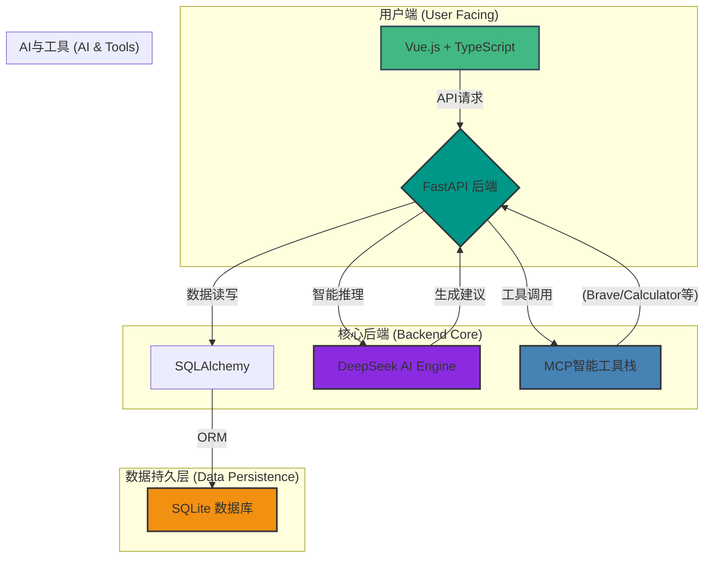

# AuraWell - 超个性化健康生活方式编排AI Agent

AuraWell 是一款前沿的、由AI驱动的个性化健康管理平台。它深度整合用户的健身目标、日常作息、饮食偏好乃至工作与社交日程，旨在提供高度智能化的情境感知健康建议，并支持用户轻松养成健康习惯。

## 核心特性

- **🤖 深度智能引擎**: 搭载先进的DeepSeek R1模型，具备卓越的推理能力，能够生成真正个性化的健康指导。
- **🛠️ MCP智能工具栈**: 集成13个专业化的MCP（Mission Critical Platform）服务器，实现健康评估、数据分析、信息检索等任务的自动化协作。
- **🔗 全方位数据整合**: 支持与薄荷健康、小米健康、苹果HealthKit等主流健康平台的数据同步，构建全面的用户健康画像。
- **👨‍👩‍👧‍👦 家庭健康守护**: 提供家庭多成员管理、健康目标互动挑战及基于家庭作息的智能提醒，关爱每一位家人。
- **📊 实时数据洞察**: 通过动态仪表盘、长期趋势分析图表，将复杂的健康数据转化为直观、可操作的洞察。

## 技术架构

我们采用现代化的技术栈，确保系统的高性能、可扩展性和安全性。



## 快速开始

### 环境要求
- Python 3.9+
- Node.js 16+
- Git

### 安装与启动

1.  **克隆项目**
    ```bash
    git clone https://github.com/[YOUR_USERNAME]/AuraWell_Agent.git
    cd AuraWell_Agent
    ```

2.  **配置后端**
    ```bash
    # 创建并激活Python虚拟环境
    python -m venv aurawell_env
    # Windows:
    # aurawell_env\Scripts\activate
    # macOS/Linux:
    source aurawell_env/bin/activate

    # 安装依赖
    pip install -r requirements.txt

    # 初始化数据库（非常重要！）
    # 这会根据迁移脚本创建或更新数据库表
    alembic upgrade head

    # 配置环境变量
    cp env.example .env
    # 根据需要编辑 .env 文件，填入你的API密钥
    ```

3.  **配置前端**
    ```bash
    cd frontend
    npm install
    ```

4.  **启动服务**
    ```bash
    # 启动后端 (在项目根目录)
    # 服务将运行在 http://localhost:8000
    uvicorn src.aurawell.main:app --host 0.0.0.0 --port 8000 --reload

    # 启动前端 (在 frontend 目录)
    # 在新的终端窗口中执行
    npm run dev
    ```

5.  **访问应用**
    在浏览器中打开 `http://localhost:5173` 即可开始体验 AuraWell 健康助手。

## 项目结构

```
AuraWell_Agent/
├── frontend/         # Vue.js 前端代码
│   ├── src/
│   └── package.json
├── src/
│   └── aurawell/     # FastAPI 后端核心代码
│       ├── agent/    # AI Agent与工具定义
│       ├── core/     # 核心逻辑与编排器
│       ├── database/ # 数据库模型与连接
│       ├── services/ # 各业务模块服务
│       └── main.py   # FastAPI 应用入口
├── migrations/       # Alembic 数据库迁移脚本
├── .cursorrules      # AI 助手行为与项目规则
├── README.md         # 就是我
└── requirements.txt  # Python 依赖
```

## API文档

项目启动后，可在 `http://localhost:8000/docs` 查看由FastAPI自动生成的完整API文档。

## 贡献指南

我们欢迎来自社区的任何贡献！

1.  Fork 本项目。
2.  创建您的特性分支 (`git checkout -b feature/AmazingFeature`)。
3.  提交您的更改 (`git commit -m 'Add some AmazingFeature'`)。
4.  将代码推送到您的分支 (`git push origin feature/AmazingFeature`)。
5.  创建一个新的 Pull Request。

## 联系我们

- **项目主页**: https://github.com/[YOUR_USERNAME]/AuraWell_Agent
- **问题反馈**: https://github.com/[YOUR_USERNAME]/AuraWell_Agent/issues

---

**让AI助力每个人都拥有更健康的生活方式** 🌟
