<div align="center">

# 🌟 AuraWell Agent

**新一代AI驱动的个人健康生活方式编排系统**

[](LICENSE)
[](https://python.org)
[](https://vuejs.org)
[](https://fastapi.tiangolo.com)
[](https://deepseek.com)

*让AI成为您的专属健康管家，开启智能生活新篇章*

[🚀 快速开始](#-快速开始) • [✨ 核心特性](#-核心特性) • [🏗️ 技术架构](#️-技术架构) • [� 使用指南](#-使用指南) • [🤝 参与贡献](#-参与贡献)

</div>

---

## 📋 项目简介

AuraWell Agent 是一款基于大语言模型的智能健康生活方式编排系统，融合了最新的AI技术栈，为用户提供个性化的健康管理、生活建议和智能决策支持。

### 🎯 核心价值

- **🧠 AI原生设计**：基于DeepSeek大模型，提供专业的健康咨询和生活建议
- **🔧 MCP工具生态**：集成13+智能工具，实现健康数据的自动化分析和处理
- **👨‍👩‍👧‍👦 家庭健康管理**：支持多成员健康档案，全家人的健康守护者
- **📊 数据驱动决策**：基于用户行为和健康数据，提供科学的生活方式建议
- **🌐 现代化体验**：响应式设计，支持多端访问，流畅的用户体验

---

## ✨ 核心特性

### 🤖 智能AI助手
- **专业健康咨询**：基于医学知识库的AI健康顾问
- **个性化建议**：根据用户画像生成定制化生活方案
- **智能对话**：自然语言交互，理解用户需求和情感

### 📈 健康数据管理
- **多维度监测**：体重、血压、心率、睡眠等全方位健康指标
- **趋势分析**：智能识别健康变化趋势，提前预警
- **可视化报告**：直观的图表展示，让数据说话

### 🛠️ MCP工具链
- **自动化工作流**：13+专业工具，覆盖健康管理全场景
- **智能决策**：基于规则引擎的自动化健康建议
- **数据同步**：多平台数据整合，统一健康档案

### 👥 家庭协作
- **多成员管理**：支持家庭成员健康档案管理
- **权限控制**：灵活的访问权限设置
- **关爱提醒**：家人健康状况实时关注

---

## 🏗️ 技术架构

### 前端技术栈
```
Vue 3 + TypeScript + Vite
├── 🎨 UI框架：Ant Design Vue
├── 📊 数据可视化：ECharts + Vue-ECharts
├── 🌐 状态管理：Pinia
├── 🛣️ 路由：Vue Router 4
├── 🎭 动画：GSAP
├── 🌍 国际化：Vue I18n
├── 📱 PWA：Vite Plugin PWA
└── 🔧 构建工具：Vite + TypeScript
```

### 后端技术栈
```
Python 3.11 + FastAPI
├── 🤖 AI引擎：DeepSeek API + LangChain
├── 🗄️ 数据库：SQLAlchemy + SQLite/PostgreSQL
├── 🔐 认证：JWT + bcrypt
├── 🛠️ MCP工具：自研MCP工具管理器
├── 📝 API文档：OpenAPI + Swagger UI
├── 🔄 异步处理：asyncio + uvicorn
└── 📊 监控：结构化日志 + 错误追踪
```

### 核心架构图

```mermaid
graph TB
    A[用户界面 Vue 3] --> B[API网关 FastAPI]
    B --> C[AI引擎 DeepSeek]
    B --> D[MCP工具链]
    B --> E[数据层 SQLAlchemy]

    C --> F[健康咨询]
    C --> G[智能分析]

    D --> H[健康监测工具]
    D --> I[数据分析工具]
    D --> J[生活建议工具]

    E --> K[用户档案]
    E --> L[健康数据]
    E --> M[对话历史]
```



---

## 🚀 快速开始

### 环境要求

| 技术栈 | 版本要求 | 说明 |
|--------|----------|------|
| Python | 3.11+ | 后端运行环境 |
| Node.js | 18+ | 前端构建环境 |
| Git | 2.0+ | 版本控制 |

### 一键部署

```bash
# 1. 克隆项目
git clone https://github.com/PrescottClub/AuraWell_Agent.git
cd AuraWell_Agent

# 2. 后端启动
pip install -r requirements.txt
cp env.example .env
# 配置您的API密钥到 .env 文件
python src/aurawell/main.py

# 3. 前端启动（新终端）
cd frontend
npm install
npm run dev
```

### 访问地址

| 服务 | 地址 | 说明 |
|------|------|------|
| 🌐 前端应用 | http://localhost:5173 | 用户界面 |
| 🔧 后端API | http://localhost:8001 | API服务 |
| 📚 API文档 | http://localhost:8001/docs | Swagger文档 |

### 体验账号

```
用户名：test_user
密码：test_password
```

---

## 📖 使用指南

### 🔧 环境配置

创建 `.env` 文件并配置以下参数：

```bash
# AI服务配置
DEEPSEEK_API_KEY=your_deepseek_api_key_here
DEEPSEEK_BASE_URL=https://api.deepseek.com/v1
DEEPSEEK_MODEL=deepseek-chat

# 数据库配置
DATABASE_URL=sqlite:///./aurawell.db

# JWT安全配置
JWT_SECRET_KEY=your_super_secret_jwt_key_here
JWT_ALGORITHM=HS256
JWT_ACCESS_TOKEN_EXPIRE_MINUTES=30

# 应用配置
DEBUG=false
LOG_LEVEL=INFO
```

### 🚀 部署指南

#### Docker部署（推荐）

```bash
# 构建镜像
docker-compose build

# 启动服务
docker-compose up -d

# 查看日志
docker-compose logs -f
```

#### 生产环境部署

```bash
# 后端生产部署
gunicorn src.aurawell.main:app -w 4 -k uvicorn.workers.UvicornWorker

# 前端构建
cd frontend
npm run build

# 使用Nginx代理
sudo cp nginx.conf /etc/nginx/sites-available/aurawell
sudo nginx -s reload
```

---

## 🎨 功能演示

### 💬 AI健康咨询
<details>
<summary>点击查看演示</summary>

```
用户：我最近总是感觉疲劳，应该怎么办？

AI助手：根据您的描述，疲劳可能由多种因素引起。让我为您分析：

🔍 可能原因：
• 睡眠质量不佳
• 营养摄入不均衡
• 缺乏运动
• 工作压力过大

💡 建议方案：
1. 改善睡眠：保持7-8小时优质睡眠
2. 均衡饮食：增加蛋白质和维生素摄入
3. 适量运动：每天30分钟有氧运动
4. 压力管理：尝试冥想或深呼吸练习

📊 是否需要我帮您制定详细的改善计划？
```
</details>

### 📊 健康数据分析
<details>
<summary>点击查看演示</summary>

- **体重趋势**：智能识别体重变化模式
- **血压监测**：异常值自动预警
- **睡眠分析**：睡眠质量评分和改善建议
- **运动统计**：运动量分析和目标设定
</details>

### 👨‍👩‍👧‍👦 家庭健康管理
<details>
<summary>点击查看演示</summary>

- **成员档案**：为每位家庭成员建立独立健康档案
- **权限管理**：灵活设置查看和编辑权限
- **健康提醒**：重要健康指标异常时及时通知
- **报告分享**：生成家庭健康报告
</details>

---

## 🤝 参与贡献

我们欢迎所有形式的贡献！无论是代码、文档、设计还是想法。

### 🔧 开发贡献

1. **Fork** 本仓库
2. **创建** 特性分支 (`git checkout -b feature/AmazingFeature`)
3. **提交** 更改 (`git commit -m 'Add some AmazingFeature'`)
4. **推送** 到分支 (`git push origin feature/AmazingFeature`)
5. **创建** Pull Request

### 📝 贡献指南

- 遵循现有代码风格
- 添加适当的测试用例
- 更新相关文档
- 确保CI/CD通过

### 🐛 问题反馈

发现Bug？有新想法？欢迎提交Issue：

- 🐛 [Bug报告](https://github.com/PrescottClub/AuraWell_Agent/issues/new?template=bug_report.md)
- 💡 [功能建议](https://github.com/PrescottClub/AuraWell_Agent/issues/new?template=feature_request.md)

---

## 📄 开源协议

本项目基于 [MIT License](LICENSE) 开源协议。

---

## 🙏 致谢

感谢以下开源项目和服务：

- [DeepSeek](https://deepseek.com) - 提供强大的AI能力
- [Vue.js](https://vuejs.org) - 优秀的前端框架
- [FastAPI](https://fastapi.tiangolo.com) - 现代化的Python Web框架
- [Ant Design Vue](https://antdv.com) - 企业级UI组件库

---

<div align="center">

**⭐ 如果这个项目对您有帮助，请给我们一个Star！**

Made with ❤️ by [PrescottClub](https://github.com/PrescottClub)

</div>

