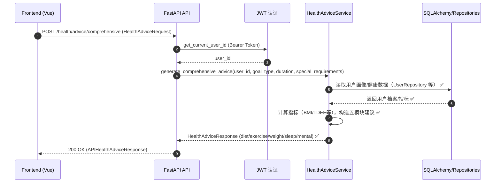
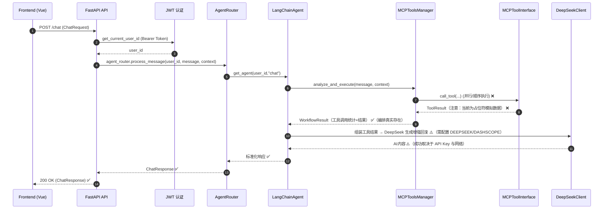

# AuraWell 项目综合分析报告

---

## 1. 项目概述与目的

AuraWell 是一个新一代的、由 AI 驱动的个人健康生活方式编排系统。其核心目标是解决健身规划中训练、营养与恢复三者脱节的痛点。为此，该项目实现了一个深度个性化的智能健康 AI Agent，该 Agent 能够为用户提供全周期、闭环式的智能健康规划。

**核心价值主张:**

-   **AI 原生架构**: 基于前沿的大型语言模型 (DeepSeek) 构建专业级的健康咨询引擎。
-   **MCP 智能编排**: 通过一个包含 13+ 工具的智能编排系统 (MCP)，实现对健康管理的闭环。
-   **家庭生态系统**: 支持多成员健康档案，实现协同式健康管理。
-   **数据驱动洞察**: 融合 RAG 知识检索与实时数据分析，提供科学的生活方式干预方案。

---

## 2. 技术架构概览

该项目采用现代化的全栈技术架构，确保了企业级的用户体验和系统稳定性。

### 2.1. 前端技术栈

-   **核心框架**: Vue.js 3
-   **构建工具**: Vite
-   **状态管理**: Pinia
-   **路由**: Vue Router
-   **UI 框架**: Ant Design Vue & Tailwind CSS
-   **编程语言**: JavaScript 和 TypeScript

### 2.2. 后端技术栈

-   **Web 框架**: FastAPI
-   **数据库 ORM**: SQLAlchemy
-   **AI 框架**: LangChain
-   **核心 LLM**: DeepSeek
-   **认证**: JWT
-   **缓存**: Redis

---

## 3. 功能与实现细节分析

### 3.1. 后端架构与功能详解

后端的 AI Agent 是整个系统的核心，其架构设计精良，具有高度的模块化和健壮性。以下是其核心模块的详细分析：

#### 3.1.1. API 端点与核心功能

应用的业务功能通过 `src/aurawell/interfaces/api_interface.py` 中定义的 RESTful API 端点暴露。所有端点都遵循 `/api/v1/` 的路径前缀，并按功能进行分组。

-   **认证 (`/auth`)**:
    -   `POST /login`, `POST /register`: 标准的用户登录和注册功能。
    -   `POST /logout`: 用户登出，会将当前 token 加入黑名单。
    -   `GET /me`, `GET /profile`: 获取当前登录用户的基本信息和详细健康档案。

-   **AI 聊天 (`/chat`)**:
    -   `POST /chat`: 核心的 AI 聊天接口，处理用户的自然语言消息，并路由到 AI Agent 进行处理。
    -   `GET /conversations`, `GET /conversations/{id}/messages`: 提供完整的对话历史记录管理功能。

-   **健康管理 (`/health`)**:
    -   `POST /advice/comprehensive`: 生成包含饮食、运动、体重、睡眠和心理健康五个模块的综合性健康建议。
    -   `GET /summary`: 获取用户在指定时间段内的健康数据摘要（如活动、睡眠等）。
    -   `GET /goals`, `POST /goals`: 管理用户的个人健康目标。
    -   `GET /plans`, `POST /plans/generate`: 管理和生成个性化的多日健康计划。

-   **家庭管理 (`/family`)**:
    -   `POST /family`, `GET /family/{id}`: 创建和管理家庭圈。
    -   `POST /{id}/invite`, `POST /invitation/accept`: 邀请家庭成员并处理邀请。
    -   `GET /{id}/members`, `GET /{id}/leaderboard`, `GET /{id}/challenges`: 提供家庭成员管理、健康排行榜和家庭挑战等社交功能。

-   **MCP 与 RAG (`/mcp`, `/rag`)**:
    -   `GET /mcp/health`, `GET /mcp/tools`: 提供对 MCP 智能工具系统的健康检查和状态监控。
    -   `POST /rag/retrieve`: 暴露 RAG (检索增强生成) 功能，用于从知识库中检索信息。

#### 3.1.2. 数据库架构与数据模型

数据持久化通过 SQLAlchemy ORM 实现，数据库模型在 `src/aurawell/database/models.py` 中定义。

-   **核心模型**:
    -   `UserProfileDB`: 存储用户的核心档案信息，包括个人信息 (年龄、性别、身高、体重)、认证信息 (密码哈希) 和健康目标。
    -   `ActivitySummaryDB`, `SleepSessionDB`, `HeartRateSampleDB`: 分别存储来自可穿戴设备或其他来源的日常活动、睡眠和心率数据。
    -   `ConversationDB`, `MessageDB`: 存储用户与 AI Agent 的完整对话历史。
    -   `HealthPlanDB`: 存储为用户生成的个性化健康计划。

-   **数据关系**: 模型之间通过 `relationship` 建立了清晰的外键关联，例如，一个 `UserProfileDB` 实例可以关联多个 `ActivitySummaryDB` 记录。

-   **数据验证**: API 层的数据模型 (位于 `src/aurawell/models/api_models.py`) 使用 Pydantic 进行严格的数据验证，确保了传入数据的格式正确性和安全性。

#### 3.1.3. 认证与授权流程

认证系统在 `src/aurawell/auth/jwt_auth.py` 中实现，流程如下：

1.  **登录**: 用户通过 `/auth/login` 端点提交用户名和密码。
2.  **验证**: `authenticate_user` 函数会验证凭据。它首先检查数据库中的用户，如果找不到，则会回退到一组硬编码的“演示用户”。
3.  **Token 生成**: 验证成功后，`create_access_token` 函数会生成一个 JWT。该 JWT 的载荷 (payload) 中包含了用户的 ID (`sub`) 和过期时间 (`exp`)。
4.  **受保护的访问**: 当用户访问受保护的端点时，必须在 `Authorization` 请求头中提供 `Bearer <token>`。
5.  **Token 验证**: FastAPI 的依赖注入系统会自动调用 `get_current_user_id` 函数。该函数会解码并验证 JWT 的签名和过期时间，然后从载荷中提取用户 ID，供后续的业务逻辑使用。

#### 3.1.4. 中间件与错误处理

-   CORS: 通过 `configure_cors(app)` 统一启用跨域访问，允许前端访问。
-   可信主机: `TrustedHostMiddleware` 仅允许 `localhost/127.0.0.1/*.aurawell.com/testserver`。
-   性能中间件: `@app.middleware("http") add_process_time_header` 记录每个请求耗时，超过 500ms 产生告警，指标写入性能监控器。
-   统一异常处理: `aurawell_exception_handler/http_exception_handler/validation_exception_handler/general_exception_handler` 确保错误响应结构一致。

#### 3.1.5. Agent 工作流与编排

-   入口与路由: `AgentRouter`（src/aurawell/core/agent_router.py）负责为每个用户与上下文生成/缓存 Agent 实例。
-   Agent 实现: `LangChainAgent=HealthAdviceAgent`（src/aurawell/langchain_agent/agent.py）。其处理流程：
    1) 优先尝试 MCP 智能工作流：`_execute_mcp_workflow` 调用 `MCPToolsManager.analyze_and_execute`；
    2) 若工具链成功，使用 `_generate_mcp_enhanced_response` 将工具结果注入 Prompt，由 DeepSeek 生成增强回复；
    3) 否则回退到“传统健康建议”或“直接 LLM 回复”；
    4) 具有本地兜底 `_get_local_response`，保障在 LLM 不可用时的用户体验。
-   记忆与上下文: `MemoryManager` 管理会话历史，Agent 也维护最近对话窗口用于 Prompt 构建。
-   LLM 接入: 首选 `DeepSeekClient`（ServiceClientFactory 提供），可选 LangChain ChatOpenAI 包装，失败时自动降级。

#### 3.1.6. MCP 工具系统（实现状态）

-   意图分析: `IntentAnalyzer`（langchain_agent/mcp_tools_manager.py）基于关键字触发多种“场景”工作流（health_analysis/nutrition_planning/fitness_planning/...），设定并行或顺序执行策略。
-   执行引擎: `MCPToolsManager` 支持并行/顺序/条件三种模式、超时控制、错误聚合、统计指标（成功率/平均耗时）。
-   工具接口: `MCPToolInterface` 统一封装 13 个工具（calculator/database-sqlite/quickchart/brave-search/fetch/sequential-thinking/memory/weather/time/run-python/github/filesystem/figma）。
-   重要现状（未打通链路）:
    - 所有工具方法当前均为“占位符返回模拟数据”，即便触发成功，也不执行真实外部动作；
    - settings.py 支持 `MCP_TOOL_MODE=real_mcp|placeholder|hybrid`，但未看到对真实 MCP Server 的实际调用桥接代码；
    - 结论：MCP 智能编排流程“决策与编排已就绪”，但“工具执行仍为假实现”。

#### 3.1.7. RAG 服务

-   端点: `POST /api/v1/rag/retrieve`, `GET /api/v1/rag/status`。
-   依赖: requirements.txt 中包含 `alibabacloud_fc20230330` 等 SDK，settings.py 暴露 `ALIBABA_CLOUD_*` 配置（endpoint/key/secret/functionName）。
-   现状判断: 若 `.env` 正确配置，`get_rag_service()` 有机会是可运行的；但未在仓库中看到完整的 FC 调用代码与签名逻辑细节，建议实测与补全超时/重试/签名异常处理。

#### 3.1.8. 配置系统（settings.py）

-   配置来源: dotenv + 环境变量，集中暴露于 `AuraWellSettings`。
-   关键项:
    - AI: `DASHSCOPE_API_KEY/DEEPSEEK_MODEL/DEEPSEEK_*`；
    - RAG: `ALIBABA_CLOUD_FC_ENDPOINT/ACCESS_KEY_ID/ACCESS_KEY_SECRET/RAG_*`；
    - 安全: `JWT_SECRET/JWT_ALGORITHM/JWT_ACCESS_TOKEN_EXPIRE_MINUTES`；
    - 缓存: `REDIS_URL`；
    - MCP: `MCP_ENABLE_REAL_TOOLS/MCP_TOOL_MODE/MCP_SERVER_TIMEOUT/BRAVE_API_KEY/GITHUB_TOKEN/FIGMA_TOKEN`；
    - 通用: `DEBUG/LOG_LEVEL/TIMEZONE` 等。
-   校验: `validate_required_settings()` 会返回缺失的关键项，便于部署前检查。

#### 3.1.9. 授权与权限

-   认证: 统一使用 JWT（`get_current_user_id` 作为依赖），支持 Token 黑名单撤销；开发模式支持 `dev-test-token`。
-   授权: 存在 `permissions.py`，但当前端点未见显式 RBAC 校验调用；前端 Admin 路由使用 `meta.isAdmin`，后端需要补充“角色/权限”存储与校验以闭环。

### 3.2. 前端架构与功能详解

前端是一个基于 Vue.js 3 和 Vite 构建的现代化单页应用 (SPA)，其代码结构清晰，遵循了组件化开发的最佳实践。

#### 3.2.1. 状态管理 (Pinia)

全局状态由 Pinia 集中管理，相关模块位于 `src/stores/`。

-   **`auth.js`**: 这是认证体系的核心。它管理 JWT `token`、过期时间等状态，并将其持久化到 `localStorage`。核心方法 `ensureAuthenticated()` 负责在访问受保护资源前验证用户身份，包含了防止重复验证和开发环境自动登录等优化。
-   **其他 Stores**: 还包括 `chat.js`, `family.js`, `healthPlan.js` 等，分别管理对应功能模块的状态，实现了业务逻辑的有效隔离。

#### 3.2.2. 路由与导航守卫

路由系统在 `src/router/index.js` 中定义，负责页面导航和访问控制。

-   **路由结构**: 应用分为公共区域 (`/login`, `/register`)、用户区域 (`/`) 和管理区域 (`/admin`)。大部分页面组件都使用了懒加载 (`() => import(...)`) 以优化初始加载性能。
-   **全局导航守卫 (`router.beforeEach`)**: 这是前端安全的核心。它会检查目标路由的 `meta: { requiresAuth: true }` 字段。如果需要认证，守卫会调用 `authStore.ensureAuthenticated()` 来验证用户。若验证失败，则自动重定向到登录页。

#### 3.2.3. API 通信层

前端与后端的通信被优雅地抽象在 `src/api/` 和 `src/utils/request.js` 中。

-   **API 模块**: `src/api/` 目录下的文件（如 `user.js`, `chat.js`）将所有与特定功能领域相关的 API 调用封装成独立的类或函数。
-   **Axios 包装器 (`request.js`)**: 这是一个中心的 Axios 实例，通过**拦截器**实现了自动化：
    -   **请求拦截器**: 自动从 `authStore` 获取 token 并附加到所有需要认证的请求头中。
    -   **响应拦截器**: 提供全局的错误处理，特别是对 `401 Unauthorized` 错误，它会自动清除本地 token 并重定向到登录页，防止认证循环。

#### 3.2.4. 组件化结构

-   **`src/components/`**: 存放可复用的基础组件，并按功能（如 `chat`, `charts`, `ui`）进行了分组。
-   **`src/views/`**: 存放页面级组件，每个组件都对应一个具体的路由。
-   **`src/composables/`**: 存放 Vue 3 的组合式函数，用于封装和复用有状态的逻辑（如 `usePerformanceMonitor.ts`）。
-   **`src/layout/`**: 包含布局组件 (`BasicLayout.vue`, `AdminLayout.vue`)，用于定义不同页面的整体结构，保持 UI 的一致性。

---

## 5. API 端点清单（核心分组与示例）

说明：所有端点均以 `/api/v1` 为前缀，绝大多数受 JWT 保护（需 `Authorization: Bearer <token>`）。

- 认证 Authentication
  - POST /auth/login（登录，返回 TokenResponse）
  - POST /auth/register（注册）
  - POST /auth/logout（登出，写入黑名单）
  - GET /auth/profile（前端兼容，获取当前用户档案）
  - PUT /auth/profile（前端兼容，更新当前用户档案）

- 聊天 Chat
  - POST /chat（标准聊天，返回 ChatResponse）
  - POST /chat/message（前端兼容，返回通用字典结构）
  - POST /chat/conversation（创建会话）
  - GET  /chat/conversations（列出会话）
  - GET  /chat/conversations/{conversation_id}/messages（会话消息）
  - DELETE /chat/conversation/{conversation_id}（删除会话）
  - GET  /chat/history（按条件获取历史）
  - GET  /chat/suggestions（返回健康建议模板）

- 健康建议 Health Advice
  - POST /health/advice/comprehensive（五模块综合建议）
  - POST /health/advice/quick?topic=...（快速建议）

- RAG 检索
  - POST /rag/retrieve（知识检索）
  - GET  /rag/status（服务状态）

- MCP 工具监控
  - GET /mcp/health（健康检查与告警）
  - GET /mcp/tools（工具清单与模式）
  - GET /mcp/performance（性能报告与告警）

- 用户档案与健康数据
  - GET  /user/profile，PUT /user/profile（Pydantic 模型）
  - GET  /user/profile/frontend，PUT /user/profile/frontend（前端兼容简化格式）
  - GET  /user/health-data，PUT /user/health-data（体重、身高、BMI 等）
  - GET  /user/health-goals，POST /user/health-goals，PUT/DELETE /user/health-goals/{goal_id}

- 健康摘要与明细
  - GET /health/summary（近 N 天汇总）
  - GET /health/activity（分页/排序/过滤的活动数据）
  - GET /health/sleep（睡眠数据）

- 健康计划 Health Plans
  - GET  /health/plans（列表）
  - GET  /health/plans/{plan_id}（详情）
  - POST /health/plans/generate（AI 生成计划）
  - PUT  /health/plans/{plan_id}（更新）
  - DELETE /health/plans/{plan_id}（删除）
  - GET  /health/plans/{plan_id}/export?format=pdf（导出）
  - GET/PUT /health/plans/{plan_id}/progress（进度读写）
  - POST /health/plans/{plan_id}/feedback（反馈）
  - GET  /health/plans/templates；POST /health/plans/from-template

- 家庭 Family
  - POST /family（创建），GET /family（我的家庭列表），GET /family/user-families（前端兼容）
  - GET /family/{family_id}（信息）
  - POST /family/{family_id}/invite（邀请）
  - POST /family/invitation/accept | /family/invitation/decline（处理邀请）
  - GET /family/{family_id}/members（成员）
  - GET /family/{family_id}/permissions（权限）
  - POST /family/switch-member（切换当前成员）
  - GET /family/{family_id}/leaderboard | /challenges（排行榜/挑战）
  - GET /family/{family_id}/report（健康报告）
  - POST /family/members/{member_id}/like（点赞）
  - GET /family/{family_id}/health-alerts（健康告警）

- 系统
  - GET /health（系统健康），GET /system/performance（性能指标），GET /

注：上述端点在代码中均有实现，但部分依赖“Mock Repository/Service”，详见第 8 节“未打通链路”。

---

## 6. 数据库模式与关系（要点）

表与主字段（摘自 SQLAlchemy 模型）：
- user_profiles（UserProfileDB）
  - user_id(PK), display_name, email(unique), password_hash, age, gender,
    height_cm, weight_kg, activity_level, goals(JSON), notification_preferences(JSON) 等
- activity_summaries（ActivitySummaryDB）
  - id(PK), user_id(FK→user_profiles), date, steps, distance_meters, active_calories,
    recorded_at；(Unique user_id+date+source_platform)
- sleep_sessions（SleepSessionDB）
  - id(PK), user_id(FK), date, bedtime_utc, wake_time_utc, total_sleep_minutes, sleep_quality_score
- heart_rate_samples（HeartRateSampleDB）
  - id(PK), user_id(FK), timestamp_utc, bpm, measurement_type
- nutrition_entries（NutritionEntryDB）
  - id(PK), user_id(FK), date, meal_type, food_name, calories, macros...
- achievement_progress（AchievementProgressDB）
  - id(PK), user_id(FK), achievement_type/level, progress_percentage, unlocked_at
- platform_connections（PlatformConnectionDB）
  - id(PK), user_id(FK), platform_name, platform_user_id, tokens, last_sync_at
- conversations（ConversationDB）
  - id(PK), user_id(FK), title, type, status, created_at；关联 messages
- messages（MessageDB）
  - id(PK), conversation_id(FK→conversations), sender(user/agent), content, created_at
- 健康计划（HealthPlanDB 等）
  - 由 `repositories.health_plan_repository` 读写：计划、模块、进度、反馈、模板等实体（详见仓库与接口）。

关系要点：user_profiles 与 activity/sleep/hr/nutrition/achievement/platform/conversations 等是一对多；conversations 与 messages 是一对多；健康计划与用户是一对多，计划与模块/进度/反馈关联。

---

## 7. 配置与环境变量（关键项）

- AI：DASHSCOPE_API_KEY, DEEPSEEK_MODEL, DEEPSEEK_MAX_TOKENS, DEEPSEEK_TEMPERATURE
- JWT：JWT_SECRET/JWT_ALGORITHM/JWT_ACCESS_TOKEN_EXPIRE_MINUTES（settings.py）
- RAG：ALIBABA_CLOUD_FC_ENDPOINT/ACCESS_KEY_ID/ACCESS_KEY_SECRET/RAG_*（超时/重试）
- MCP：MCP_ENABLE_REAL_TOOLS, MCP_TOOL_MODE(hybrid), MCP_SERVER_TIMEOUT，BRAVE_API_KEY/GITHUB_TOKEN/FIGMA_TOKEN
- 数据库：DATABASE_URL（默认 SQLite），REDIS_URL（缓存）
- 安全：CORS_ORIGINS/ALLOWED_HOSTS（在环境与 Nginx 中配合）

---

## 8. 依赖与外部服务

- 语言/框架：Python 3.11, FastAPI, SQLAlchemy 2.x, Alembic, LangChain 0.1.x
- AI/LangChain：openai>=1.50.0（用于 DashScope 兼容调用）、langchain, langchain-openai
- 测试：pytest, selenium（端到端 UI 测试）
- RAG：alibabacloud_fc20230330 等阿里云函数计算 SDK
- 前端：Vue 3, Vite 6, Pinia, Vue Router, Ant Design Vue, ECharts, Sentry 等

外部集成：
- DeepSeek（经由 DashScope 兼容 API）
- 健康平台客户端（integrations/）：Apple、小米、薄荷健康（Bohe）客户端已封装但需配置密钥与授权流程
- 阿里云函数计算（RAG）
- MCP 工具（Brave、QuickChart、Weather、GitHub、Figma 等）— 当前为占位符实现

---

## 9. 构建与部署

- 开发：
  - 后端：`python src/aurawell/main.py`（Uvicorn 开发模式）
  - 前端：`cd frontend && npm run dev`
- 生产：
  - 后端：`gunicorn src.aurawell.main:app -w 4 -k uvicorn.workers.UvicornWorker`
  - 前端：`npm run build`，由 Nginx 提供静态资源；Nginx 反向代理到后端 8001
- 文档：`/docs`（Swagger UI），`/redoc`

---

## 10. 未打通链路与风险清单（需要注意）

- MCP 工具层：`MCPToolInterface` 的 13 个工具全部为占位符，返回模拟数据；需对接真实 MCP Server 或直接实现各工具调用。
- 健康仓库层：`get_health_repository()` 与 `get_achievement_repository()` 当前为 Mock；`get_user_repository()`/`get_health_plan_repository()` 在数据库不可用时也会降级为 Mock。
- FamilyInteractionService：在 API 注入处返回 Mock 实例（点赞/家庭告警为模拟行为）。
- 前端 API：`src/api/user.js` 中 `getHealthData/getHealthGoals` 等为 Mock 数据；与后端真实端点尚未完全打通。
- RAG 服务：配置与接口存在，但未见完整生产级调用实现与异常处理，需实测与加固（签名/重试/限流/熔断）。
- 授权：后端缺少与 `meta.isAdmin` 对应的 RBAC 实体与校验逻辑，管理端口权限依赖需要补齐。

---

## 11. 路线图与优先级建议（落地可执行）

1) 打通端到端最小闭环（高优先级）
- 将前端 API 的 Mock 替换为真实调用，优先用户档案/健康摘要/健康目标；
- 后端仓库由 Mock 切换为真实 SQLAlchemy Session（确保 sqlite 可写、迁移成功、添加基础种子数据）；
- 为 `/health/advice/comprehensive` 增加更多异常兜底与超时控制，提升稳定性。

2) MCP 工具从占位符升级为可用实现（高优先级）
- 选 3-5 个工具（calculator/database-sqlite/quickchart/brave-search/weather）先打通；
- 引入真实 MCP Server（Node CLI）或直接在 Python 侧集成等效 SDK（如 Brave 搜索 API、QuickChart HTTP、SQLite 原生查询）；
- 完善 `ToolResult` 结构与错误上报，扩展性能监控维度（P95 时延、错误码聚合）。

3) 数据库与权限（中高优）
- 迁移到 PostgreSQL/MySQL（生产），补齐 Alembic 迁移脚本；
- 引入角色/权限表与装饰器，补齐 Admin 后端授权；
- 增强 Token 黑名单策略（批量撤销、按用户撤销、缓存加速）。

4) RAG 与可观测性（中优）
- 完成阿里云 FC 调用链路与重试/熔断；
- 增加 Sentry/Prometheus 指标上报，补充业务 KPI（建议生成成功率、端到端耗时）。

5) 测试与 DevEx（中优）
- 编写集成测试（API + DB + Agent 编排），UI 端到端用例补齐（登录/家庭/健康计划）；
- 本地一键脚本与 Docker 化（docker-compose：api+db+redis+nginx）。

以上改进完成后，系统将具备“可用、可迭代、可观测”的生产级特性，能够支撑后续功能扩展（多设备同步、更多健康场景工作流、AI 策略优化等）。


---

## 12. 关键业务链路顺序图（Sequence Diagrams）


提示符号说明：
- ✅ 已打通（真实实现/具备真实外部调用）
- ❌ 未打通（占位/Mock/模拟数据）
- ⚠️ 需配置/待验证（有代码路径但需配置/测试）


### 12.1 综合健康建议生成（/api/v1/health/advice/comprehensive）


说明：此链路不依赖 Agent 与 MCP，直接通过服务层产出结构化建议，适合提供稳定的业务输出。

### 12.2 聊天 + MCP 增强（/api/v1/chat）


说明：当前 MCPI 工具调用为占位符，需替换为真实实现或对接 MCP Server 才能形成端到端真实增强。

### 12.3 家庭邀请与加入
```mermaid
sequenceDiagram
    autonumber
    participant OwnerFE as 家庭拥有者前端
    participant InviteeFE as 被邀请者前端
    participant API as FastAPI API
    participant AUTH as JWT 认证
    participant FS as FamilyService
    participant DB as SQLAlchemy/Repositories

    OwnerFE->>API: POST /family/{family_id}/invite (email, role)
    API->>AUTH: 验证 Owner Token
    AUTH-->>API: owner_user_id
    API->>FS: invite_member(family_id, invite_request, owner_user_id) ⚠️（FamilyService 需与DB会话完整打通）
    FS->>DB: 校验权限/重复性，写入邀请记录 ⚠️
    DB-->>FS: 邀请记录 ⚠️
    FS-->>API: InviteMemberResponse（包含邀请码/状态） ⚠️
    API-->>OwnerFE: 200 OK ⚠️

    InviteeFE->>API: POST /family/invitation/accept (invite_code)
    API->>AUTH: 验证 Invitee Token ✅

### 12.4 RAG 生产级调用链（阿里云 FC）
```mermaid
sequenceDiagram
    autonumber
    participant FE as Frontend (Vue)
    participant API as FastAPI API
    participant AUTH as JWT 认证
    participant RAG as RAG Service Facade
    participant FCSDK as Alibaba FC SDK
    participant FC as Function Compute
    participant VDB as Vector DB (DashVector)

    FE->>API: POST /rag/retrieve (user_query,k)
    API->>AUTH: get_current_user_id (Bearer Token)
    AUTH-->>API: user_id ✅
    API->>RAG: retrieve_from_rag(user_query,k) ⚠️（需正确配置 ALIBABA_CLOUD_*）
    RAG->>FCSDK: invoke(function_name, payload, timeout) ⚠️
    FCSDK->>FC: 署名请求（AK/SK，超时=RAG_REQUEST_TIMEOUT） ⚠️
    FC->>VDB: 语义向量检索（topK） ⚠️
    VDB-->>FC: 相似文档 + 分数 ⚠️
    FC-->>FCSDK: 标准化结果（片段/元数据） ⚠️
    FCSDK-->>RAG: 响应 ⚠️
    RAG->>RAG: 解析/裁剪/聚合 ✅
    RAG-->>API: RAGQueryResponse ✅
    API-->>FE: 200 OK ✅

    alt 超时/网络异常
        FCSDK--x RAG: Timeout/ConnectionError ❌
        RAG->>RAG: 重试（指数退避+抖动）⚠️
        RAG-->>API: 错误信息或降级提示 ✅
        API-->>FE: 5xx/业务错误消息 ✅
    end
```

### 12.5 RAG 重试 / 熔断策略清单（建议落地）
- 超时与预算
  - 单次调用超时：settings.RAG_REQUEST_TIMEOUT（默认 30s，建议 8–12s）
  - 端到端预算：<= 3×单次超时；超出立即失败并返回可读错误
- 重试（仅对幂等读操作）
  - 次数：最多 3 次；策略：指数退避（1s, 2s, 4s）+ 抖动（±20%）
  - 触发：网络错误、5xx、显式超时；不对 4xx（如签名错误/权限不足）重试
  - 透传 correlation_id 以便排障
- 熔断（Circuit Breaker）
  - 维度：按目标 FC 函数统计 1 分钟滚动窗口失败率
  - 阈值：连续失败 ≥ N（建议 5）或失败率 ≥ 50% → 打开熔断 60s
  - 半开：尝试 1 次探测成功则关闭；失败继续打开
  - 打开期间直接快速失败并返回可读降级提示
- 速率与并发
  - 客户端并发上限（每实例）：建议 10–20；出现 429/限流响应时退避
  - 增加请求排队与超时取消，避免堆积
- 错误分类与处理
  - 4xx：配置/签名/权限问题 → 记录并提示“配置缺失或无权限”，不重试
  - 5xx/网络：可重试；超过预算后返回降级结果
  - 业务校验失败：明确提示参数问题（query/k 为空、不合法）
- 安全与凭证
  - AK/SK 存储在环境变量/密钥管理，不写入代码；支持密钥轮换
  - 署名请求引入 timestamp/nonce 防重放
- 观测与追踪
  - 指标：请求计数、成功率、P50/P95 延迟、重试次数、熔断状态
  - 日志：结构化 JSON（level/module/correlation_id/user_id）
  - 追踪：在请求头与日志中贯穿 correlation_id（如 X-Request-ID）
- 降级方案
  - 返回本地缓存/最近成功结果（TTL 5–15 分钟）或可读提示
  - 页面提示“知识检索暂不可用，已记录问题编号：<request_id>”

    AUTH-->>API: invitee_user_id ✅
    API->>FS: accept_invite(invite_code, invitee_user_id) ⚠️
    FS->>DB: 验证邀请有效性并建立家庭成员关系 ⚠️
    DB-->>FS: 成功 ⚠️
    FS-->>API: FamilyInfoResponse（成员列表/角色） ⚠️
    API-->>InviteeFE: 200 OK ⚠️
```

---

## 13. 数据库 ER 图与字段字典

### 13.1 ER 图（核心实体关系）
```mermaid
erDiagram
    USER_PROFILES ||--o{ ACTIVITY_SUMMARIES : has
    USER_PROFILES ||--o{ SLEEP_SESSIONS : has
    USER_PROFILES ||--o{ HEART_RATE_SAMPLES : has
    USER_PROFILES ||--o{ NUTRITION_ENTRIES : has
    USER_PROFILES ||--o{ ACHIEVEMENT_PROGRESS : has
    USER_PROFILES ||--o{ PLATFORM_CONNECTIONS : has
    USER_PROFILES ||--o{ CONVERSATIONS : has
    CONVERSATIONS ||--o{ MESSAGES : contains
    USER_PROFILES ||--o{ HEALTH_PLANS : has
    USER_PROFILES ||--|| USER_HEALTH_PROFILE : has_one

    USER_PROFILES {
      string user_id PK
      string email UNIQUE
      string display_name
      string password_hash
      int age
      string gender
      float height_cm
      float weight_kg
      string activity_level
      json notification_preferences
      json connected_platforms
      json platform_user_ids
      json health_goals
      string timezone
      string preferred_units
    }
    ACTIVITY_SUMMARIES {
      int id PK
      string user_id FK
      date date
      int steps
      float distance_meters
      float active_calories
      float total_calories
      int active_minutes
      string source_platform
      string data_quality
      datetime recorded_at tz
      UNIQUE(user_id,date,source_platform)
    }
    SLEEP_SESSIONS {
      int id PK
      string user_id FK
      date date
      datetime bedtime_utc tz
      datetime wake_time_utc tz
      int total_sleep_minutes
      int deep_sleep_minutes
      int light_sleep_minutes
      int rem_sleep_minutes
      int awake_minutes
      float sleep_efficiency
      float sleep_quality_score
      string source_platform
      string data_quality
      datetime recorded_at tz
      UNIQUE(user_id,date,source_platform)
    }
    HEART_RATE_SAMPLES {
      int id PK
      string user_id FK
      datetime timestamp_utc tz
      int bpm
      string measurement_type
      string context
      string source_platform
      string data_quality
      datetime recorded_at tz
    }
    NUTRITION_ENTRIES {
      int id PK
      string user_id FK
      date date
      string meal_type
      string food_name
      float quantity
      string unit
      float calories
      float protein_g
      float carbs_g
      float fat_g
      float fiber_g
      float sugar_g
      float sodium_mg
      string source_platform
      string data_quality
      datetime recorded_at tz
    }
    ACHIEVEMENT_PROGRESS {
      int id PK
      string user_id FK
      string achievement_type
      string achievement_level
      float current_value
      float target_value
      bool is_unlocked
      datetime unlocked_at tz
      float progress_percentage
      datetime last_updated tz
      UNIQUE(user_id,achievement_type,achievement_level)
    }
    PLATFORM_CONNECTIONS {
      int id PK
      string user_id FK
      string platform_name
      string platform_user_id
      text access_token
      text refresh_token
      datetime token_expires_at tz
      bool is_active
      datetime last_sync_at tz
      string sync_status
      json sync_preferences
      UNIQUE(user_id,platform_name)
    }
    CONVERSATIONS {
      string id PK
      string user_id FK
      string title
      string type
      string status
      json extra_metadata
      datetime created_at tz
      datetime updated_at tz
    }
    MESSAGES {
      string id PK
      string conversation_id FK
      string sender
      text content
      json extra_metadata
      datetime created_at tz
    }
    USER_HEALTH_PROFILE {
      string user_id PK/FK
      // 具体字段见 models，存储健康特定信息
    }
    HEALTH_PLANS {
      string id PK
      string user_id FK
      // 具体字段见 health_plan_repository
    }
```

注：HEALTH_PLANS 与 USER_HEALTH_PROFILE 在源码中存在（仓库/模型引用），但详细字段分布在仓库层或未完全展示，已在表中标注说明。

### 13.2 字段字典（类型/约束/索引）

- user_profiles（UserProfileDB）
  - 主键：user_id (String(255))
  - 唯一：email
  - JSON：notification_preferences, connected_platforms, platform_user_ids, health_goals
  - 默认：timezone="UTC", preferred_units="metric"
  - 关系：一对多到 activity/sleep/hr/nutrition/achievement/platform/conversations；一对一到 user_health_profile；一对多到 health_plans

- activity_summaries（ActivitySummaryDB）
  - 约束：UNIQUE(user_id, date, source_platform)
  - 索引：idx_activity_user_date(user_id, date)

- sleep_sessions（SleepSessionDB）
  - 约束：UNIQUE(user_id, date, source_platform)
  - 索引：idx_sleep_user_date(user_id, date)

- heart_rate_samples（HeartRateSampleDB）
  - 索引：idx_hr_user_timestamp(user_id, timestamp_utc)

- nutrition_entries（NutritionEntryDB）
  - 索引：idx_nutrition_user_date(user_id, date)

- achievement_progress（AchievementProgressDB）
  - 约束：UNIQUE(user_id, achievement_type, achievement_level)
  - 索引：idx_achievement_user_type(user_id, achievement_type)

- platform_connections（PlatformConnectionDB）
  - 约束：UNIQUE(user_id, platform_name)
  - 索引：idx_platform_user_name(user_id, platform_name)

- conversations（ConversationDB）
  - 索引：idx_conversation_user_id(user_id), idx_conversation_created_at(created_at), idx_conversation_status(status)

- messages（MessageDB）
  - 索引：idx_message_conversation_id(conversation_id), idx_message_created_at(created_at), idx_message_sender(sender)

- user_health_profile / health_plans
  - 由 `repositories` 或模型扩展定义，强关联 user_id；建议补充实体化迁移与索引规划（user_id、更新时间、状态字段）。

---

## 4. 当前状态评估：优势、技术债务与未完成部分

### 4.1. 实现优势

1.  **先进的 AI 架构**: MCP 智能工具系统是一个显著的创新。它通过一个基于规则的、可预测的工作流引擎，实现了对复杂任务的自动化处理，这比单纯依赖 LLM 进行工具选择更加稳定和高效。

2.  **清晰的关注点分离**: 前后端都遵循了优秀的软件设计原则，使得代码库易于理解、维护和扩展。

3.  **健壮的设计**: 系统在多个层面都考虑了健壮性，确保应用在遇到问题时能够优雅地降级，而不是完全崩溃。

### 4.2. 技术债务与未完成部分 (关键问题)

1.  **❗️链路不通：模拟数据与占位符实现**: 这是当前项目状态中最关键的问题。**整个项目的核心功能链路是不通的**。
    *   **后端**: `MCPToolInterface` 中所有 13 个工具的具体实现都是**占位符**，仅返回硬编码的模拟数据。这意味着虽然 AI 的决策和编排架构已经完成，但它无法执行任何真实的操作（如查询数据库、生成图表等）。
    *   **前端**: `src/api/user.js` 中多个与健康数据和目标相关的 API 调用也是**模拟的**，并未连接到真实的后端端点。
    *   **结论**: 虽然应用的“骨架”和“大脑”已经搭建完成，但“手臂”和“腿脚”尚未实现。**下一步开发的最高优先级应该是替换这些占位符和模拟数据，实现端到端的功能链路。**

2.  **数据库选型**: 项目目前使用 SQLite，这对于开发和测试来说非常方便。然而，对于需要处理高并发请求的生产环境，应迁移到更强大的数据库系统，如 PostgreSQL 或 MySQL。

3.  **测试覆盖率**: `README.md` 中描述了一个全面的测试策略，但实际的测试代码需要进一步扩充，特别是针对复杂的 AI 工作流和 MCP 系统的集成测试。

