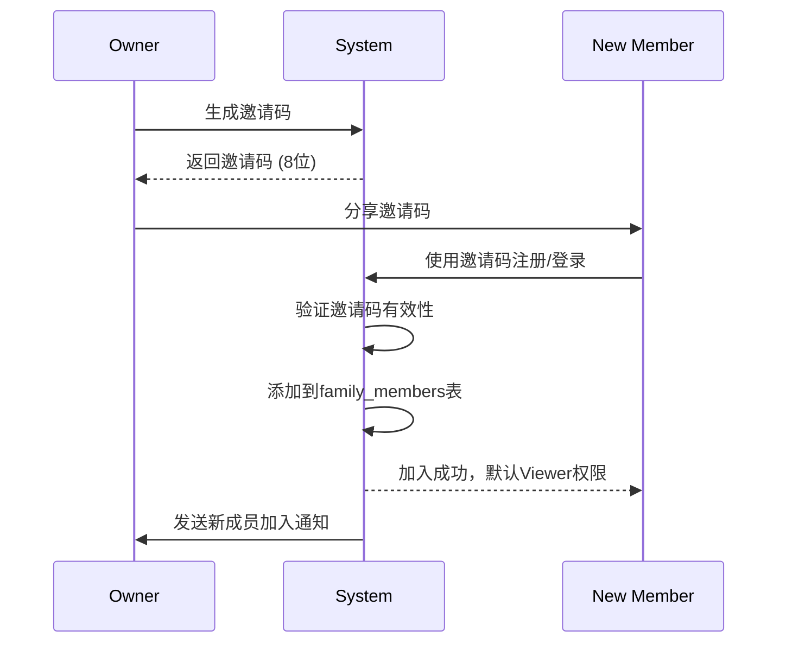

# 家庭多用户健康管理架构设计

## 概述

AuraWell采用"主账号 + 家庭成员"的多用户架构，支持一个家庭内多个成员的健康管理，包含完整的权限控制体系和智能告警机制。

## 用户角色体系

### 角色定义

| 角色 | 英文名 | 权限级别 | 主要职责 |
|------|--------|----------|----------|
| 主账号 | Owner | 最高权限 | 创建家庭、邀请成员、设置权限、接收所有告警 |
| 管理者 | Manager | 管理权限 | 查看指定成员数据、设置目标、接收相关告警 |
| 查看者 | Viewer | 基础权限 | 查看个人数据、生成个人计划 |

### 权限矩阵

| 功能 | Owner | Manager | Viewer |
|------|-------|---------|--------|
| 创建/删除家庭成员 | ✅ | ❌ | ❌ |
| 邀请新成员 | ✅ | ❌ | ❌ |
| 设置成员权限 | ✅ | ❌ | ❌ |
| 查看所有成员数据 | ✅ | 👥指定成员 | 👤仅自己 |
| 设置健康目标 | ✅ | 👥指定成员 | 👤仅自己 |
| 接收健康告警 | ✅全部 | 👥相关成员 | 👤仅自己 |
| 生成健康报告 | ✅ | 👥指定成员 | 👤仅自己 |
| 家庭挑战管理 | ✅ | ❌ | ❌ |

## 数据库设计

### 核心表结构

```sql
-- 用户表
CREATE TABLE users (
    id CHAR(36) PRIMARY KEY,
    username VARCHAR(50) UNIQUE NOT NULL,
    email VARCHAR(100) UNIQUE NOT NULL,
    password_hash VARCHAR(255) NOT NULL,
    created_at TIMESTAMP DEFAULT CURRENT_TIMESTAMP,
    updated_at TIMESTAMP DEFAULT CURRENT_TIMESTAMP ON UPDATE CURRENT_TIMESTAMP
);

-- 家庭表
CREATE TABLE families (
    id CHAR(36) PRIMARY KEY,
    name VARCHAR(100) NOT NULL,
    owner_id CHAR(36) NOT NULL,
    invitation_code VARCHAR(20) UNIQUE,
    created_at TIMESTAMP DEFAULT CURRENT_TIMESTAMP,
    FOREIGN KEY (owner_id) REFERENCES users(id) ON DELETE CASCADE
);

-- 家庭成员表
CREATE TABLE family_members (
    id CHAR(36) PRIMARY KEY,
    family_id CHAR(36) NOT NULL,
    user_id CHAR(36) NOT NULL,
    role ENUM('owner', 'manager', 'viewer') NOT NULL,
    joined_at TIMESTAMP DEFAULT CURRENT_TIMESTAMP,
    FOREIGN KEY (family_id) REFERENCES families(id) ON DELETE CASCADE,
    FOREIGN KEY (user_id) REFERENCES users(id) ON DELETE CASCADE,
    UNIQUE KEY unique_family_user (family_id, user_id)
);

-- 权限控制表
CREATE TABLE acl_permissions (
    id CHAR(36) PRIMARY KEY,
    grantor_id CHAR(36) NOT NULL, -- 授权人
    grantee_id CHAR(36) NOT NULL, -- 被授权人
    target_user_id CHAR(36) NOT NULL, -- 目标用户
    permission_type ENUM('read', 'write', 'admin') NOT NULL,
    resource_type ENUM('health_data', 'goals', 'reports', 'alerts') NOT NULL,
    granted_at TIMESTAMP DEFAULT CURRENT_TIMESTAMP,
    expires_at TIMESTAMP NULL,
    FOREIGN KEY (grantor_id) REFERENCES users(id) ON DELETE CASCADE,
    FOREIGN KEY (grantee_id) REFERENCES users(id) ON DELETE CASCADE,
    FOREIGN KEY (target_user_id) REFERENCES users(id) ON DELETE CASCADE
);

-- 告警设置表
CREATE TABLE alert_settings (
    id CHAR(36) PRIMARY KEY,
    user_id CHAR(36) NOT NULL,
    alert_type ENUM('weight_change', 'heart_rate', 'sleep_quality', 'activity') NOT NULL,
    threshold_value DECIMAL(10,2),
    comparison_type ENUM('greater_than', 'less_than', 'change_percent') NOT NULL,
    notification_channels JSON, -- ['wechat', 'sms', 'app']
    recipients JSON, -- [user_id1, user_id2, ...]
    is_enabled BOOLEAN DEFAULT TRUE,
    created_at TIMESTAMP DEFAULT CURRENT_TIMESTAMP,
    FOREIGN KEY (user_id) REFERENCES users(id) ON DELETE CASCADE
);
```

## 家庭成员邀请流程

### 1. 邀请码生成

```python
def generate_invitation_code(family_id: str) -> str:
    """生成8位邀请码"""
    import random
    import string
    
    code = ''.join(random.choices(string.ascii_uppercase + string.digits, k=8))
    
    # 检查唯一性
    while check_invitation_code_exists(code):
        code = ''.join(random.choices(string.ascii_uppercase + string.digits, k=8))
    
    # 更新家庭表
    update_family_invitation_code(family_id, code)
    return code
```

### 2. 成员加入流程



### 3. 权限管理

```python
class FamilyPermissionManager:
    def __init__(self, db_session):
        self.db = db_session
    
    def grant_permission(self, grantor_id: str, grantee_id: str, 
                        target_user_id: str, permission_type: str,
                        resource_type: str) -> bool:
        """授予权限"""
        # 检查授权人是否有权限授权
        if not self.can_grant_permission(grantor_id, target_user_id):
            return False
        
        permission = ACLPermission(
            grantor_id=grantor_id,
            grantee_id=grantee_id,
            target_user_id=target_user_id,
            permission_type=permission_type,
            resource_type=resource_type
        )
        
        self.db.add(permission)
        self.db.commit()
        return True
    
    def check_permission(self, user_id: str, target_user_id: str,
                        permission_type: str, resource_type: str) -> bool:
        """检查用户权限"""
        # 自己的数据总是可以访问
        if user_id == target_user_id:
            return True
        
        # 查询ACL权限表
        permission = self.db.query(ACLPermission).filter(
            ACLPermission.grantee_id == user_id,
            ACLPermission.target_user_id == target_user_id,
            ACLPermission.permission_type == permission_type,
            ACLPermission.resource_type == resource_type,
            or_(
                ACLPermission.expires_at.is_(None),
                ACLPermission.expires_at > datetime.utcnow()
            )
        ).first()
        
        return permission is not None
```

## 智能告警机制

### 告警触发器

```python
class HealthAlertSystem:
    def __init__(self):
        self.alert_processors = {
            'weight_change': self.process_weight_alert,
            'heart_rate': self.process_heart_rate_alert,
            'sleep_quality': self.process_sleep_alert,
            'activity': self.process_activity_alert
        }
    
    async def check_alerts(self, user_id: str, health_data: dict):
        """检查健康数据异常并触发告警"""
        user_alerts = self.get_user_alert_settings(user_id)
        
        for alert in user_alerts:
            if not alert.is_enabled:
                continue
            
            processor = self.alert_processors.get(alert.alert_type)
            if processor and processor(health_data, alert):
                await self.send_alert(user_id, alert, health_data)
    
    def process_weight_alert(self, data: dict, alert: AlertSetting) -> bool:
        """体重变化告警"""
        current_weight = data.get('weight')
        if not current_weight:
            return False
        
        # 获取过去7天的体重数据
        historical_weights = self.get_historical_weights(alert.user_id, days=7)
        if len(historical_weights) < 2:
            return False
        
        avg_weight = sum(historical_weights) / len(historical_weights)
        change_percent = abs(current_weight - avg_weight) / avg_weight * 100
        
        if alert.comparison_type == 'change_percent':
            return change_percent > alert.threshold_value
        
        return False
    
    async def send_alert(self, user_id: str, alert: AlertSetting, data: dict):
        """发送告警通知"""
        recipients = self.get_alert_recipients(user_id, alert.recipients)
        message = self.generate_alert_message(alert.alert_type, data)
        
        for recipient_id in recipients:
            for channel in alert.notification_channels:
                if channel == 'wechat':
                    await self.send_wechat_alert(recipient_id, message)
                elif channel == 'sms':
                    await self.send_sms_alert(recipient_id, message)
                elif channel == 'app':
                    await self.send_app_notification(recipient_id, message)
```

### 告警消息模板

```python
ALERT_TEMPLATES = {
    'weight_change': {
        'title': '体重异常变化提醒',
        'template': '{member_name}的体重在过去7天变化{change_percent:.1f}%，请关注健康状况。当前体重：{current_weight}kg'
    },
    'heart_rate': {
        'title': '心率异常提醒',
        'template': '{member_name}的心率为{heart_rate}bpm，{status}正常范围，建议及时关注。'
    },
    'sleep_quality': {
        'title': '睡眠质量提醒',
        'template': '{member_name}的睡眠质量评分为{sleep_score}分，深睡时间仅{deep_sleep}小时，建议改善睡眠习惯。'
    },
    'activity': {
        'title': '运动量不足提醒',
        'template': '{member_name}今日步数仅{steps}步，建议增加日常活动量。'
    }
}
```

## 家庭互动功能

### 1. 家庭仪表盘数据结构

```python
class FamilyDashboardData:
    def __init__(self, family_id: str):
        self.family_id = family_id
    
    def get_family_health_summary(self) -> dict:
        """获取家庭健康概览"""
        members = self.get_family_members()
        
        summary = {
            'total_members': len(members),
            'weekly_stats': {
                'total_steps': 0,
                'total_workouts': 0,
                'avg_sleep_hours': 0,
                'active_members': 0
            },
            'leaderboard': {
                'steps': [],
                'workouts': [],
                'sleep_quality': [],
                'weight_progress': []
            },
            'challenges': self.get_active_challenges(),
            'achievements': self.get_recent_achievements()
        }
        
        for member in members:
            weekly_data = self.get_member_weekly_data(member.user_id)
            summary['weekly_stats']['total_steps'] += weekly_data.get('steps', 0)
            summary['weekly_stats']['total_workouts'] += weekly_data.get('workouts', 0)
            
            # 更新排行榜
            self.update_leaderboard(summary['leaderboard'], member, weekly_data)
        
        summary['weekly_stats']['avg_sleep_hours'] = (
            sum(m.sleep_hours for m in members if m.sleep_hours) / len(members)
        )
        
        return summary
```

### 2. 家庭挑战系统

```python
class FamilyChallenge:
    def __init__(self, family_id: str, challenge_type: str, 
                 target_value: float, duration_days: int):
        self.family_id = family_id
        self.challenge_type = challenge_type  # 'steps', 'weight_loss', 'workout_streak'
        self.target_value = target_value
        self.duration_days = duration_days
        self.participants = []
        self.start_date = datetime.utcnow()
        self.end_date = self.start_date + timedelta(days=duration_days)
    
    def calculate_progress(self) -> dict:
        """计算挑战进度"""
        progress = {}
        
        for participant in self.participants:
            if self.challenge_type == 'steps':
                daily_steps = self.get_daily_steps(participant, self.start_date, datetime.utcnow())
                progress[participant] = {
                    'current': sum(daily_steps),
                    'target': self.target_value,
                    'percentage': min(100, sum(daily_steps) / self.target_value * 100)
                }
        
        return progress
    
    def check_completion(self) -> list:
        """检查完成挑战的成员"""
        completed_members = []
        progress = self.calculate_progress()
        
        for member_id, data in progress.items():
            if data['percentage'] >= 100:
                completed_members.append(member_id)
        
        return completed_members
```

## API接口设计

### 家庭管理接口

```python
# GET /api/v1/family/info
{
    "family_id": "uuid",
    "name": "张家大院",
    "owner": {
        "user_id": "uuid",
        "username": "张三",
        "avatar": "https://oss.example.com/avatar.jpg"
    },
    "members": [
        {
            "user_id": "uuid",
            "username": "张太太",
            "role": "manager",
            "joined_at": "2024-01-15T10:30:00Z",
            "last_active": "2024-01-20T08:15:00Z"
        }
    ],
    "invitation_code": "ABC12345",
    "created_at": "2024-01-01T00:00:00Z"
}

# POST /api/v1/family/invite
{
    "invitation_code": "ABC12345"
}

# PUT /api/v1/family/permissions
{
    "target_user_id": "uuid",
    "permissions": [
        {
            "resource_type": "health_data",
            "permission_type": "read"
        }
    ]
}
```

### 家庭健康数据接口

```python
# GET /api/v1/family/dashboard
{
    "family_summary": {
        "total_members": 4,
        "active_today": 3,
        "weekly_stats": {
            "total_steps": 125000,
            "avg_sleep": 7.5,
            "total_workouts": 12
        }
    },
    "leaderboard": {
        "steps": [
            {"user_id": "uuid", "username": "张三", "value": 12500, "rank": 1},
            {"user_id": "uuid", "username": "张太太", "value": 11200, "rank": 2}
        ]
    },
    "challenges": [
        {
            "id": "uuid",
            "name": "家庭万步挑战",
            "type": "steps",
            "target": 70000,
            "current": 45600,
            "end_date": "2024-01-31T23:59:59Z",
            "participants": 4
        }
    ]
}
```

## 前端组件设计

### 家庭切换组件

```vue
<template>
  <div class="family-member-selector">
    <div class="current-member" @click="toggleDropdown">
      
      <span class="username">{{ currentMember.username }}</span>
      <i class="arrow-down"></i>
    </div>
    
    <div v-show="showDropdown" class="dropdown-menu">
      <div 
        v-for="member in familyMembers" 
        :key="member.user_id"
        class="member-item"
        :class="{ active: member.user_id === currentMember.user_id }"
        @click="selectMember(member)"
      >
        
        <div class="member-info">
          <span class="username">{{ member.username }}</span>
          <span class="role">{{ member.role }}</span>
        </div>
      </div>
    </div>
  </div>
</template>

<script setup>
import { ref, computed } from 'vue'
import { useFamilyStore } from '@/stores/family'

const familyStore = useFamilyStore()
const showDropdown = ref(false)

const currentMember = computed(() => familyStore.activeMember)
const familyMembers = computed(() => familyStore.members)

const toggleDropdown = () => {
  showDropdown.value = !showDropdown.value
}

const selectMember = (member) => {
  familyStore.setActiveMember(member.user_id)
  showDropdown.value = false
}
</script>
```

## 安全考虑

### 1. 权限验证中间件

```python
from functools import wraps
from flask import request, g, abort

def require_family_permission(resource_type: str, permission_type: str):
    def decorator(f):
        @wraps(f)
        def decorated_function(*args, **kwargs):
            target_user_id = request.json.get('member_id') or g.user.id
            
            if not check_family_permission(
                g.user.id, target_user_id, resource_type, permission_type
            ):
                abort(403, description="Insufficient permissions")
            
            return f(*args, **kwargs)
        return decorated_function
    return decorator

# 使用示例
@app.route('/api/v1/health/data/<member_id>')
@require_family_permission('health_data', 'read')
def get_member_health_data(member_id):
    return get_health_data(member_id)
```

### 2. 数据脱敏

```python
def sanitize_health_data(data: dict, viewer_role: str, is_self: bool) -> dict:
    """根据查看者角色和关系脱敏健康数据"""
    if is_self or viewer_role == 'owner':
        return data  # 完整数据
    
    if viewer_role == 'manager':
        # 管理者可看基础指标，不可看详细数据
        return {
            'weight': data.get('weight'),
            'height': data.get('height'),
            'bmi': data.get('bmi'),
            'steps': data.get('steps'),
            'sleep_hours': data.get('sleep_hours')
            # 隐藏心率、血压等敏感数据
        }
    
    # Viewer角色不应该看到他人数据
    return {}
```

## 总结

家庭多用户架构通过完善的权限控制体系、智能告警机制和互动功能，实现了真正的家庭健康管理。核心特点包括：

1. **灵活的权限体系** - 支持Owner/Manager/Viewer三级权限
2. **智能告警机制** - 基于健康数据异常的主动通知
3. **家庭互动功能** - 排行榜、挑战赛、点赞等社交元素
4. **数据安全保护** - 多层级的权限验证和数据脱敏
5. **可扩展设计** - 支持未来添加更多家庭健康功能

该架构为AuraWell提供了坚实的多用户基础，能够满足不同家庭结构和健康管理需求。 