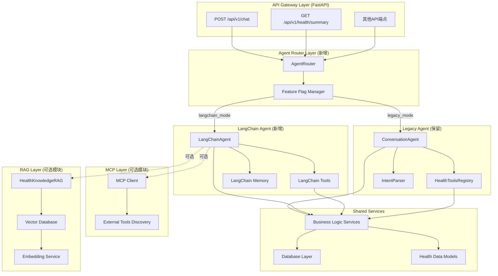

# Issue: AuraWell 后端架构升级：LangChain + RAG + MCP 集成方案（修正版）

## 🚀 项目重构概述

本方案提出对AuraWell健康助手后端进行**渐进式架构升级**，采用**双引擎并行**的策略，逐步迁移到以 **LangChain** 为核心的统一技术栈。此方案旨在最大化技术栈的先进性、标准化和可维护性，同时集成RAG（检索增强生成）和MCP（模型上下文协议）以构建下一代AI能力。

**核心策略：保持现有系统稳定运行，新功能优先使用LangChain实现，逐步替换旧模块。**

---

## 🔒 核心原则：API 绝对稳定

尽管后端进行重构，但对前端的承诺坚如磐石：

- **✅ API接口完全不变：** 所有现有 `REST API` 端点（路径、方法、参数）保持 `100%` 向后兼容
- **✅ 请求响应格式不变：** `JSON` 格式和字段结构完全一致
- **✅ 前端代码零修改：** 前端开发者无需进行任何代码改动
- **✅ 渐进式升级：** 保持现有功能稳定，新功能优先使用新架构

---

## 🎯 升级目标

- **🔄 架构现代化：** 逐步拥抱行业标准的 `LangChain` 框架，降低维护成本
- **🧠 知识驱动的智能：** 集成 `RAG` 架构，引入向量数据库和专业健康知识库
- **🔌 扩展的工具生态：** 通过 `MCP` 协议，构建开放的工具生态系统
- **📚 资产沉淀：** 构建可复用的医疗、营养、运动知识库
- **⚡ 性能优化：** 确保新架构性能不低于现有系统

---

## 🏗️ 新后端架构设计（渐进式迁移）



---

## 📚 详细实施方案

### **Phase 1: LangChain 基础设施搭建**

**目标：建立LangChain基础架构，实现双引擎并行运行**

#### 1.1 依赖管理更新

```bash
# 新增LangChain相关依赖到requirements.txt
langchain>=0.1.0
langchain-openai>=0.0.5
langchain-community>=0.0.10
langsmith>=0.0.70

# RAG相关依赖（可选）
chromadb>=0.4.0
sentence-transformers>=2.2.0
faiss-cpu>=1.7.0

# MCP相关依赖（可选）
websockets>=11.0.0
asyncio-mqtt>=0.13.0
```

#### 1.2 新增模块结构

```
aurawell/
├── agent/                     # ✅ 保留现有agent模块
│   ├── conversation_agent.py  # 现有实现
│   ├── health_tools.py        # 现有工具
│   └── tools_registry.py      # 现有注册表
├── langchain_agent/           # 🆕 新的LangChain核心
│   ├── __init__.py
│   ├── agent.py               # LangChain Agent实现
│   ├── tools/                 # LangChain工具适配器
│   │   ├── __init__.py
│   │   ├── health_tools.py    # 健康工具适配
│   │   └── adapter.py         # 工具适配器
│   ├── memory/                # 记忆管理
│   │   ├── __init__.py
│   │   └── conversation_memory.py
│   └── chains/                # 专用Chain
│       ├── __init__.py
│       └── health_chain.py
├── rag/                       # 🆕 RAG模块（Phase 2）
│   ├── __init__.py
│   ├── knowledge_service.py   # 知识检索服务
│   ├── vector_store.py        # 向量数据库
│   └── embeddings.py          # 嵌入服务
├── mcp/                       # 🆕 MCP模块（Phase 3）
│   ├── __init__.py
│   ├── client.py              # MCP客户端
│   └── discovery.py           # 工具发现
├── core/                      # ✅ 现有核心模块
│   ├── agent_router.py        # 🆕 代理路由器
│   └── feature_flags.py       # 🆕 功能开关
└── interfaces/                # ✅ 现有API接口
    └── api_interface.py       # 修改：添加路由逻辑
```

#### 1.3 Agent Router 实现

```python
# aurawell/core/agent_router.py
class AgentRouter:
    """代理路由器：根据功能开关选择使用哪个Agent"""
    
    def __init__(self):
        self.feature_flags = FeatureFlagManager()
        
    async def get_agent(self, user_id: str, feature: str = "chat") -> Union[ConversationAgent, LangChainAgent]:
        """根据功能开关返回相应的Agent"""
        if self.feature_flags.is_enabled("langchain_agent", user_id, feature):
            return LangChainAgent(user_id)
        else:
            return ConversationAgent(user_id)
```

### **Phase 2: RAG 知识库集成（独立模块）**

**目标：为Agent提供外部知识检索能力，提升回复的专业性**

#### 2.1 知识库架构

```python
# aurawell/rag/knowledge_service.py
class HealthKnowledgeRAG:
    """健康知识RAG服务"""
    
    def __init__(self):
        self.vector_store = ChromaVectorStore()
        self.embeddings = SentenceTransformerEmbeddings()
        
    async def search_knowledge(self, query: str, top_k: int = 5) -> List[Dict]:
        """搜索相关健康知识"""
        pass
        
    def as_langchain_tool(self) -> Tool:
        """转换为LangChain工具"""
        pass
```

#### 2.2 知识库内容规划

- **医疗知识：** 常见疾病、体检指标解读、症状分析
- **营养知识：** 食物成分、健康食谱、饮食禁忌、营养搭配
- **运动知识：** 训练计划、运动康复、安全指南、运动处方
- **数据源：** 权威医学网站、专业书籍、官方健康指南

### **Phase 3: MCP 协议集成（扩展功能）**

**目标：让Agent能够使用外部世界通过MCP协议提供的工具**

#### 3.1 MCP客户端实现

```python
# aurawell/mcp/client.py
class MCPClient:
    """MCP协议客户端"""
    
    async def discover_tools(self) -> List[Tool]:
        """发现外部MCP工具"""
        pass
        
    async def call_external_tool(self, tool_name: str, **kwargs) -> Any:
        """调用外部工具"""
        pass
```

---

## 🔧 技术实现细节

### 功能开关管理

```python
# aurawell/core/feature_flags.py
class FeatureFlagManager:
    """功能开关管理器"""
    
    def is_enabled(self, feature: str, user_id: str = None, context: str = None) -> bool:
        """检查功能是否启用"""
        # 支持用户级别、百分比、A/B测试等策略
        pass
```

### API接口修改

```python
# 在 aurawell/interfaces/api_interface.py 中修改
@app.post("/api/v1/chat", response_model=ChatResponse, tags=["Chat"])
async def chat(
    chat_request: ChatRequest,
    current_user_id: str = Depends(get_current_user_id),
    agent_router: AgentRouter = Depends(get_agent_router)
):
    """使用Agent Router选择合适的Agent处理请求"""
    agent = await agent_router.get_agent(current_user_id, "chat")
    ai_response = await agent.a_run(chat_request.message)
    # 返回格式保持不变
    return ChatResponse(...)
```

---

## 📊 风险控制策略

### 渐进式迁移策略

1. **功能开关控制：** 通过feature flags控制新功能的启用范围
2. **A/B测试：** 小比例用户先使用新架构，验证稳定性
3. **性能监控：** 实时监控新旧架构的性能指标
4. **回滚机制：** 出现问题时可以快速回滚到旧架构
5. **数据一致性：** 确保新旧架构使用相同的数据层

### 质量保证

- **单元测试：** 新模块100%测试覆盖率
- **集成测试：** API兼容性测试
- **性能测试：** 响应时间不超过现有系统110%
- **压力测试：** 并发能力验证

---

## 🎯 验收标准

### 功能验收

- **API兼容性：** 通过所有现有API测试用例
- **功能对等性：** 新旧架构输出结果一致性达到95%以上
- **性能达标：** 平均响应时间 ≤ 2秒，95%请求 ≤ 1秒

### 质量验收

- **测试覆盖率：** 新代码测试覆盖率 ≥ 95%
- **代码质量：** 通过所有静态代码检查
- **文档完整性：** API文档和技术文档更新完整

### RAG效果验收

- **知识准确性：** 专业健康问题回答准确率 ≥ 90%
- **响应相关性：** 知识检索相关性评分 ≥ 0.8
- **用户满意度：** 用户反馈满意度提升 ≥ 20%

---

## 📅 实施时间线

### Phase 1: LangChain基础架构（2周）
- Week 1: 依赖安装、基础模块搭建、Agent Router实现
- Week 2: 工具适配、功能开关、基础测试

### Phase 2: RAG知识库集成（3周）
- Week 1: 向量数据库搭建、知识数据收集
- Week 2: RAG服务实现、知识库构建
- Week 3: 集成测试、效果优化

### Phase 3: MCP协议集成（2周）
- Week 1: MCP客户端实现、协议对接
- Week 2: 外部工具集成、测试验证

### Phase 4: 全面测试与上线（1周）
- 端到端测试、性能优化、文档更新

---

---

## 🛠️ 具体实现代码示例

### LangChain Agent 核心实现

```python
# aurawell/langchain_agent/agent.py
from langchain.agents import AgentExecutor, create_openai_tools_agent
from langchain_openai import ChatOpenAI
from langchain.memory import ConversationBufferWindowMemory
from langchain.prompts import ChatPromptTemplate

class LangChainAgent:
    """LangChain驱动的对话代理"""

    def __init__(self, user_id: str):
        self.user_id = user_id
        self.llm = self._create_llm()
        self.tools = self._load_tools()
        self.memory = self._create_memory()
        self.agent_executor = self._create_agent()

    def _create_llm(self):
        """创建LLM实例"""
        return ChatOpenAI(
            model="deepseek-chat",
            api_key=os.getenv("DEEPSEEK_API_KEY"),
            base_url="https://api.deepseek.com/v1",
            temperature=0.7
        )

    def _load_tools(self):
        """加载所有可用工具"""
        from .tools.adapter import HealthToolsAdapter
        adapter = HealthToolsAdapter(self.user_id)
        return adapter.get_langchain_tools()

    def _create_memory(self):
        """创建对话记忆"""
        from .memory.conversation_memory import DatabaseConversationMemory
        return DatabaseConversationMemory(
            user_id=self.user_id,
            k=10  # 保留最近10轮对话
        )

    def _create_agent(self):
        """创建Agent执行器"""
        prompt = ChatPromptTemplate.from_messages([
            ("system", "你是AuraWell健康助手，专注于提供个性化健康建议..."),
            ("placeholder", "{chat_history}"),
            ("human", "{input}"),
            ("placeholder", "{agent_scratchpad}")
        ])

        agent = create_openai_tools_agent(self.llm, self.tools, prompt)
        return AgentExecutor(
            agent=agent,
            tools=self.tools,
            memory=self.memory,
            verbose=True,
            handle_parsing_errors=True
        )

    async def a_run(self, user_message: str) -> str:
        """异步处理用户消息"""
        try:
            result = await self.agent_executor.ainvoke({
                "input": user_message,
                "user_id": self.user_id
            })
            return result["output"]
        except Exception as e:
            logger.error(f"LangChain agent error: {e}")
            return f"抱歉，处理您的请求时出现问题：{str(e)}"
```

### 工具适配器实现

```python
# aurawell/langchain_agent/tools/adapter.py
from langchain.tools import Tool, StructuredTool
from langchain.pydantic_v1 import BaseModel, Field
from typing import List, Any
from ...agent.health_tools import HealthTools

class GetActivityDataInput(BaseModel):
    """获取活动数据的输入模型"""
    user_id: str = Field(description="用户ID")
    days: int = Field(default=7, description="查询天数")

class HealthToolsAdapter:
    """健康工具适配器：将现有工具转换为LangChain工具"""

    def __init__(self, user_id: str):
        self.user_id = user_id
        self.health_tools = HealthTools()

    def get_langchain_tools(self) -> List[Tool]:
        """获取所有LangChain工具"""
        return [
            self._create_activity_tool(),
            self._create_sleep_tool(),
            self._create_nutrition_tool(),
            self._create_goal_tool(),
            self._create_achievement_tool()
        ]

    def _create_activity_tool(self) -> StructuredTool:
        """创建活动数据工具"""
        async def get_activity_data(user_id: str, days: int = 7) -> dict:
            return await self.health_tools.get_user_activity_summary(user_id, days)

        return StructuredTool.from_function(
            func=get_activity_data,
            name="get_activity_data",
            description="获取用户的活动数据摘要，包括步数、距离、卡路里等",
            args_schema=GetActivityDataInput
        )

    # 类似地实现其他工具...
```

### 数据库记忆管理

```python
# aurawell/langchain_agent/memory/conversation_memory.py
from langchain.memory.chat_memory import BaseChatMemory
from langchain.schema import BaseMessage, HumanMessage, AIMessage
from typing import List, Dict, Any
from ...conversation.memory_manager import MemoryManager

class DatabaseConversationMemory(BaseChatMemory):
    """基于数据库的对话记忆"""

    def __init__(self, user_id: str, k: int = 10):
        super().__init__()
        self.user_id = user_id
        self.k = k
        self.memory_manager = MemoryManager()
        self.chat_memory = self._load_from_database()

    def _load_from_database(self):
        """从数据库加载对话历史"""
        # 实现从数据库加载逻辑
        pass

    def save_context(self, inputs: Dict[str, Any], outputs: Dict[str, str]) -> None:
        """保存对话上下文到数据库"""
        # 实现保存逻辑
        pass
```

---

## 🔍 监控和观测

### 性能监控指标

```python
# aurawell/core/monitoring.py
class AgentPerformanceMonitor:
    """Agent性能监控"""

    def __init__(self):
        self.metrics = {
            "response_time": [],
            "tool_usage": {},
            "error_rate": 0,
            "user_satisfaction": []
        }

    def record_response_time(self, agent_type: str, time_ms: float):
        """记录响应时间"""
        pass

    def record_tool_usage(self, tool_name: str, success: bool):
        """记录工具使用情况"""
        pass

    def get_performance_report(self) -> Dict[str, Any]:
        """获取性能报告"""
        pass
```

### 日志和追踪

```python
# 在每个关键组件中添加详细日志
import structlog

logger = structlog.get_logger(__name__)

# 在Agent Router中
logger.info("agent_selection",
           user_id=user_id,
           agent_type="langchain" if use_langchain else "legacy",
           feature_flags=enabled_flags)

# 在工具执行中
logger.info("tool_execution",
           tool_name=tool_name,
           execution_time=execution_time,
           success=success)
```

---

## 📋 迁移检查清单

### Phase 1 完成标准
- [ ] LangChain依赖安装完成
- [ ] Agent Router实现并测试通过
- [ ] 功能开关系统正常工作
- [ ] 基础工具适配器实现
- [ ] 单元测试覆盖率 ≥ 90%
- [ ] API兼容性测试通过
- [ ] 性能基准测试完成

### Phase 2 完成标准
- [ ] 向量数据库部署完成
- [ ] 健康知识库构建完成（≥1000条记录）
- [ ] RAG检索服务实现
- [ ] 知识检索准确性测试通过
- [ ] RAG工具集成到LangChain Agent
- [ ] 端到端RAG功能测试通过

### Phase 3 完成标准
- [ ] MCP客户端实现
- [ ] 外部工具发现机制实现
- [ ] 至少集成2个外部MCP工具
- [ ] MCP协议兼容性测试通过
- [ ] 安全性和权限控制实现

### 最终上线标准
- [ ] 所有功能测试通过
- [ ] 性能测试达标（响应时间 ≤ 2s）
- [ ] 压力测试通过（支持100并发用户）
- [ ] 安全测试通过
- [ ] 文档更新完成
- [ ] 运维监控配置完成

---

> **标签:** `enhancement`, `backend-only`, `architecture`, `langchain`, `rag`, `mcp`, `progressive-migration`
> **里程碑:** `M3 - 后端架构升级`
> **核心承诺:** 🔒 前端零影响，API接口完全不变，渐进式安全升级
